# How to Solve

This file documents the techniques that I use to solve multiverse star battles.
This is intended as a guide for new players, documentation for my hint system,
and as a place for me to ramble about difficulty.

Many of these techniques will be familiar to folks who are already familiar with
Star Battle, but some should be brand new thanks to the multiverse concept.

## Philosophy

All of the "books" of puzzles that I publish were created in the same way:

1. Generate many more puzzles than I need
2. Rank them by difficulty
3. Filter the big set down to a smaller set

The goal of my ranking system is to estimate how hard a human will find each
puzzle. It does this by solving like a human would. Humans look for patterns
that let them place dots/stars, and tend to notice simpler patterns before
complex ones. Similarly, my ranking system is built around a big list of
techniques, sorted by my opinion about their complexity. The computer solver
iterates down the list and checks whether each technique can apply to the
current state of the puzzle. If so, it adds some dots/stars, and jumps back to
the top of the list.

At the end, I have a trace of a possible path through the puzzle, and I can ask
questions like "what was the hardest technique that was required?" and "how many
total techniques were applied?".

This is not an original idea. Before starting this project, I was vaguely aware
that this is how Sudoku is ranked. I was also directly inspired by KrazyDad's
video series, linked from the readme.

## The hint system is the ranking system

As I built my list of techniques, I needed to constantly ask myself - "is there
a simpler move that the one the computer chose here?". I sometimes found the
text descriptions difficult to visualize, so I used AI to re-implement the
solver in javascript, and integrated it into the gui. This turned into the
"hint" feature.

## Techniques

### The rules of the puzzle

<a
href="https://joshmermelstein.com/multiverse-star-battle?book=armory&puzzle=1">
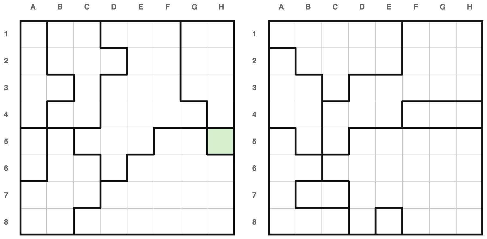</img> </a>

The rules of the puzzle say that very region must contain a star. So, if a
region has no star, and has only one empty square left, that square must be a
star.

---

<a
href="https://joshmermelstein.com/multiverse-star-battle?book=armory&puzzle=1">
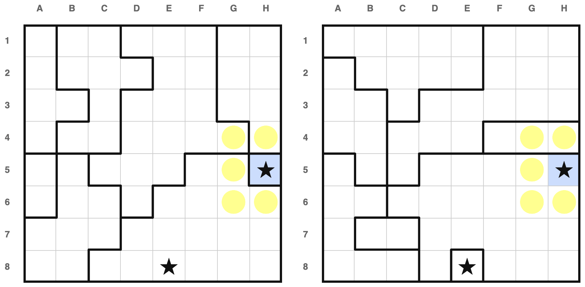</img> </a>

TODO(jmerm): better image here.

The rules also say that there is exactly one star per row, column, and region,
and that stars cannot touch, even diagonally. So after we place a star, we can
mark all cells in its row, col, regions (on both boards), and the 8 cells around
it as not containing stars.

Fun fact - this puzzle is solvable using only these two techniques. You can
click the image above, or any of the other images in this doc, to load an
interactive version of these puzzles.

### Notable shapes

There are a bunch of shapes which let you place dots. I usually start each solve
by scanning for them.

---

<a
href="https://joshmermelstein.com/multiverse-star-battle?book=armory&puzzle=2">
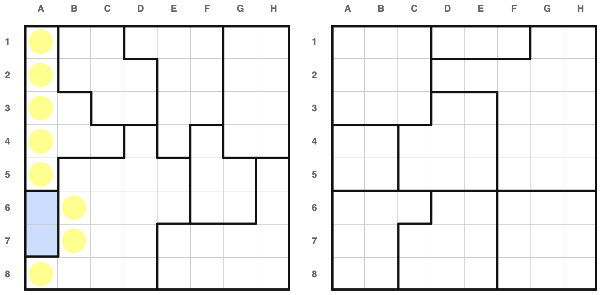</img> </a>

In this case, A6 and A7 form a domino, so there cannot be a star in the rest of
the A column, or in B6/B7.

---

<a
href="https://joshmermelstein.com/multiverse-star-battle?book=armory&puzzle=3">
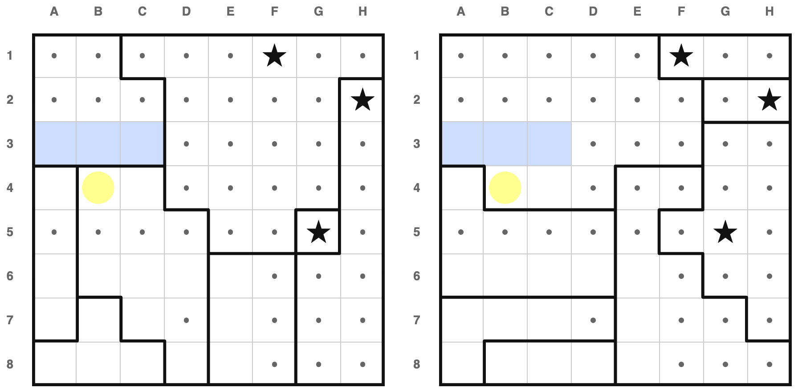</img> </a>

There must be a star in {A3, B3, C3}, because they are the only empty cells in
board 1's top-left region. A star at B4 would make this region unsolvable, so B4
must be a dot.

<a
href="https://joshmermelstein.com/multiverse-star-battle?book=armory&puzzle=3">
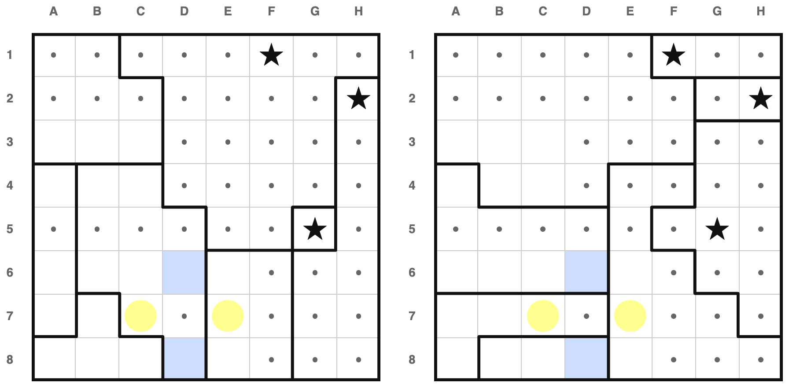</img> </a>

On the same puzzle, there must also be a star in {D6, D8}, since they are the
only empty cells left in column D. A star in C7 or E7 would make column D
impossible, so both C7 and E7 must be dots.

---

<a
href="https://joshmermelstein.com/multiverse-star-battle?book=armory&puzzle=4">
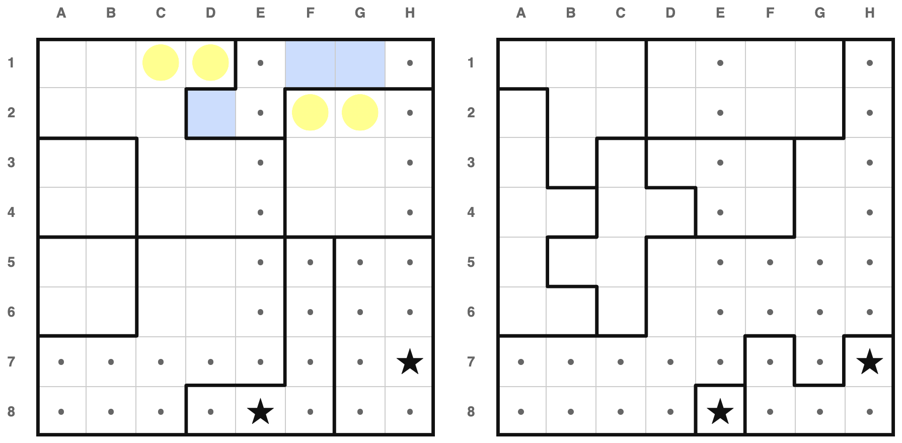</img> </a>

There must be a star in  {D2, F1, G1}, since they form a region on board 1. Each
of these cells "sees" {C1, D1, F2, G2} by row, col, or adjacency. So a star in
any of these 4 cells would make that region of board 1 unsolvable. Thus, all
four must be dots.

---

More generally, if every empty cell of an unsolved row/col/region "sees" the
same set of cells outside of that row/col/region, then those cells cannot hold a
star. I call this category of inference "sees too much".

### Adjacent rows/cols

This technique comes in 2 flavors.

A. If a group of N regions covers all the empty cells in a group of N adjacent
rows/cols - the rest of those regions cannot possibly have a star. If it did,
there wouldn't be room to satisfy all the regions.

B. If the empty cells of a group of N regions are fully contained in N adjacent
rows/cols, then the remainder of those rows/cols cannot have a star. If it did,
those regions wouldn't all be solvable.

These descriptions are pretty abstract, so let's look at some concrete examples,
starting with N=1.

#### One row/col

<a
href="https://joshmermelstein.com/multiverse-star-battle?book=armory&puzzle=5">
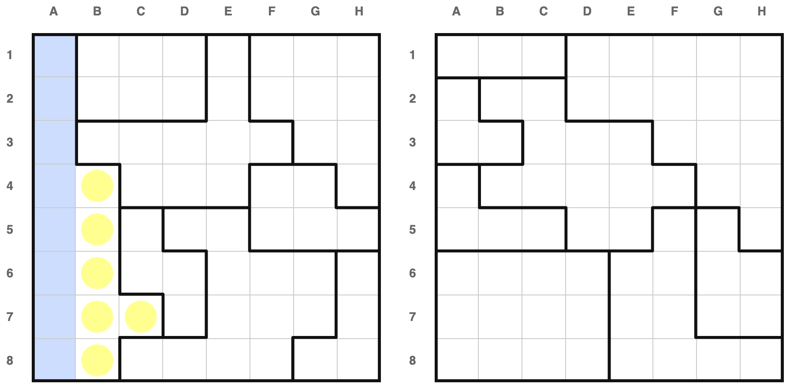</img> </a>

In this case, the leftmost region on board 1 is fully contained in column A.
Therefore, the rest of that region cannot hold a star, or column A would be
unsolvable.

---

<a
href="https://joshmermelstein.com/multiverse-star-battle?book=armory&puzzle=5">
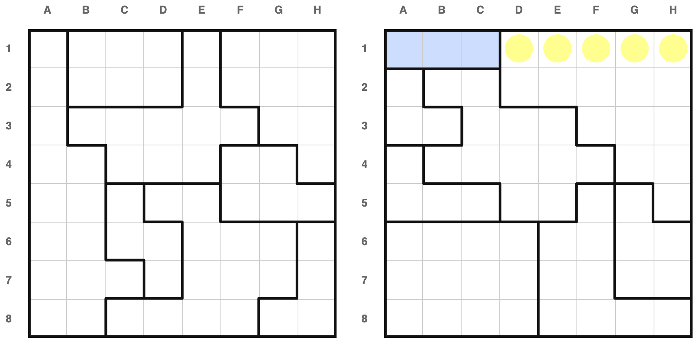</img> </a>

On the same puzzle, we can also look at the top-left region on board 2. This
region is fully contained in row 1, so the rest of row 1 cannot hold a star. If
it did, the top-left region would be unsolvable.

#### More than one row/col

<a
href="https://joshmermelstein.com/multiverse-star-battle?book=armory&puzzle=6">
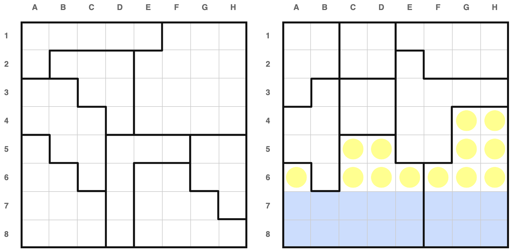</img> </a>

Now let's consider a case where N=2. In this case, the bottom-right and
bottom-left regions of board 2 combine to fill rows 7 and 8. We know that these
two rows contain two stars, so there's no room for stars in the rest of those
regions.

---

<a
href="https://joshmermelstein.com/multiverse-star-battle?book=armory&puzzle=6">
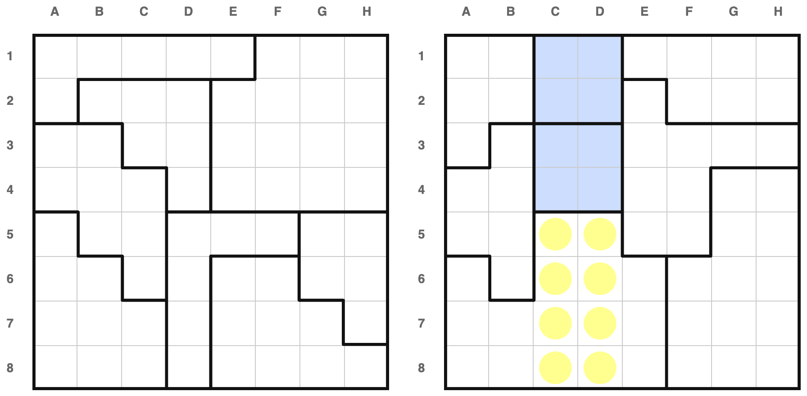</img> </a>

On the same puzzle, we can also focus on columns C and D of board 2. The two
square regions are both contained in those columns. Each region must contain a
star, so the rest of columns C and D must contain dots.

---

<a
href="https://joshmermelstein.com/multiverse-star-battle?book=armory&puzzle=7">
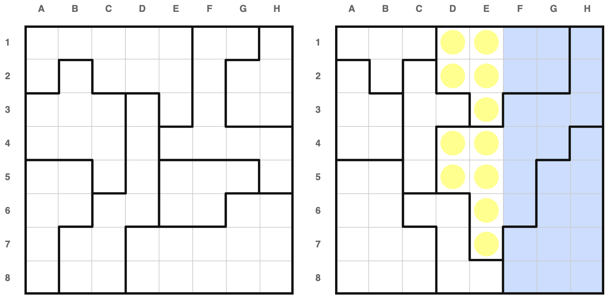</img> </a>

Moving on to N=3, the story is the same. Columns {F,G,H} on board 2 are filled
by 3 regions, so the remainder of those regions cannot have stars.

---

<a
href="https://joshmermelstein.com/multiverse-star-battle?book=armory&puzzle=7">
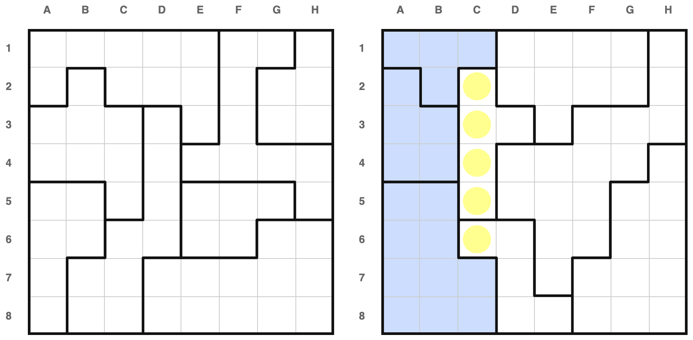</img> </a>

The same board contains an example of case B for N=3. The leftmost 3 regions on
board 2 are fully contained in columns {A,B,C}. Each region must contain a star,
so they must collectively put three stars in those three columns. Therefore the
rest of those columns must have dots.

---

<a
href="https://joshmermelstein.com/multiverse-star-battle?book=armory&puzzle=8">
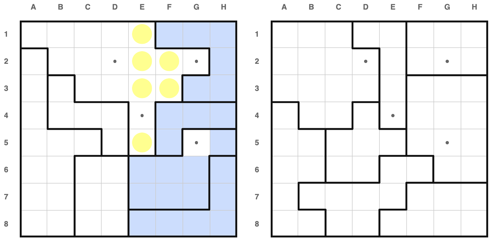</img> </a>

<a
href="https://joshmermelstein.com/multiverse-star-battle?book=armory&puzzle=8">
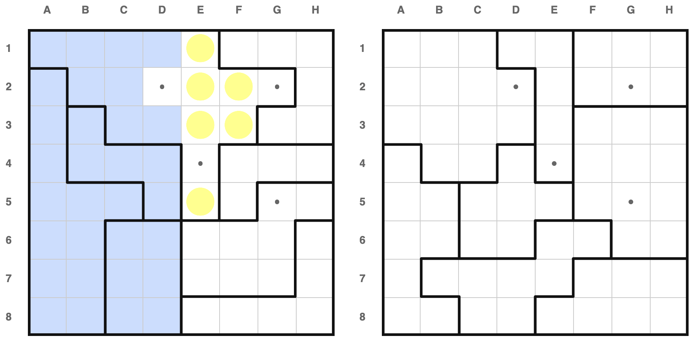</img> </a>

One last example for N=4. In this case, we can make the same observation using a
type-A inference, or a type-B inference.

### Disjoint rows/cols

I find it easier to spot row/col based inferences when the rows/cols are
contiguous, but the logic works exactly the same even if they are not. Here are
some examples:

---

<a
href="https://joshmermelstein.com/multiverse-star-battle?book=armory&puzzle=9">
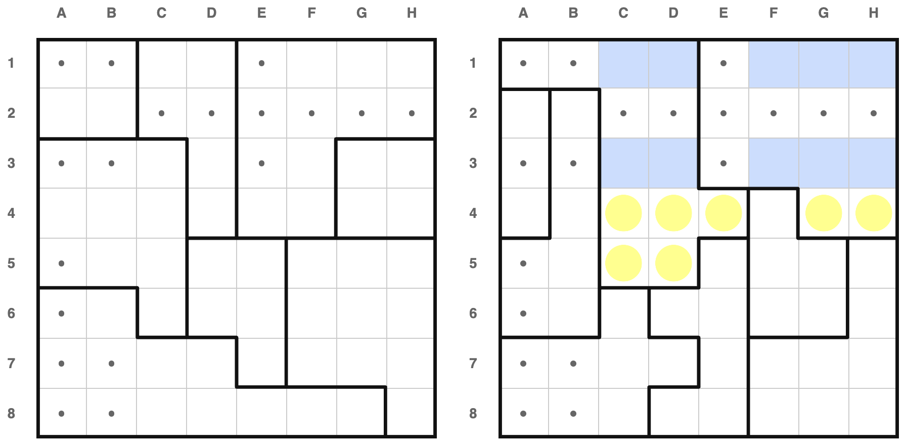</img> </a>

Look at rows 1 and 3. Together, they must contain two stars. No matter how we
place them, we'll satisfy the top two regions of board 2, so the remainder of
those regions must be dots.

---

<a
href="https://joshmermelstein.com/multiverse-star-battle?book=armory&puzzle=10">
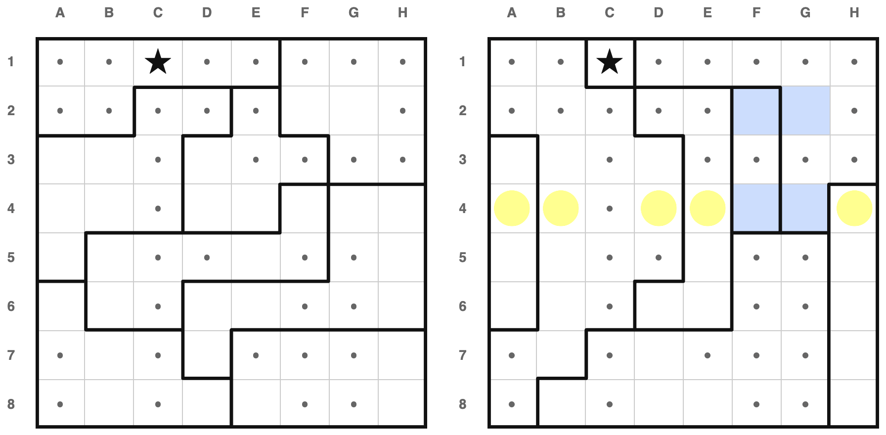</img> </a>

Look at the regions containing blue squares. Together, they must place stars in
rows 2 and 4. Therefore the rest of those rows must contain dots.

---

<a
href="https://joshmermelstein.com/multiverse-star-battle?book=armory&puzzle=11">
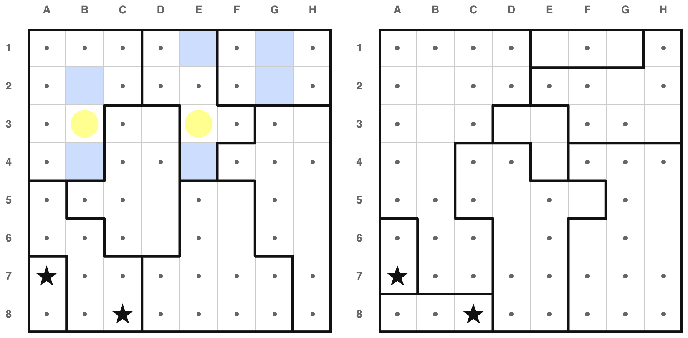</img> </a>

We can also make this type of observation with N=3 disjoint rows/cols.  Rows
{1,2,4} only see three regions, so the rest of those regions must contain dots.

---

<a
href="https://joshmermelstein.com/multiverse-star-battle?book=armory&puzzle=12">
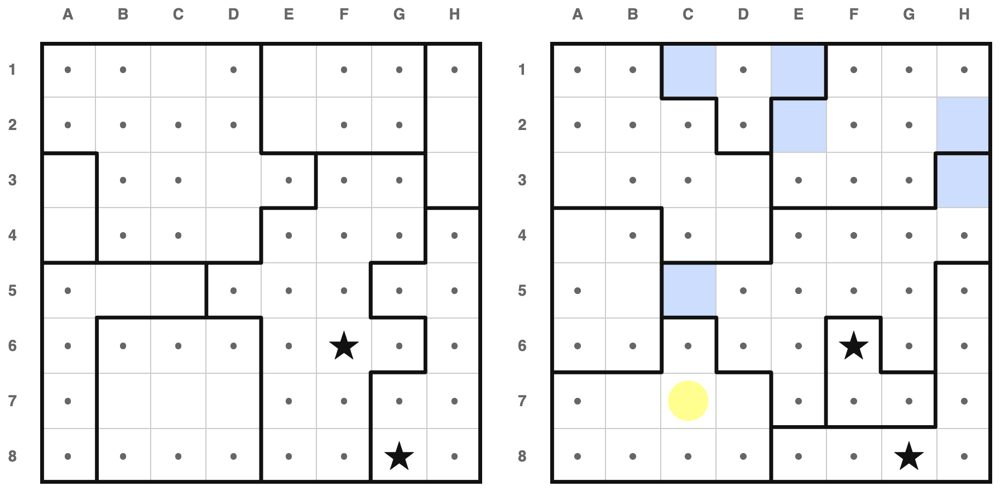</img> </a>

Three regions are fully contained in columns {C, E, H}, so the rest of those
columns must contain dots.

### Symmetry

Sometimes we can tell, just from the structure of the boards, that the solution
has some symmetry. We can use this to to our advantage.

#### Diagonal

<a
href="https://joshmermelstein.com/multiverse-star-battle?book=armory&puzzle=13">
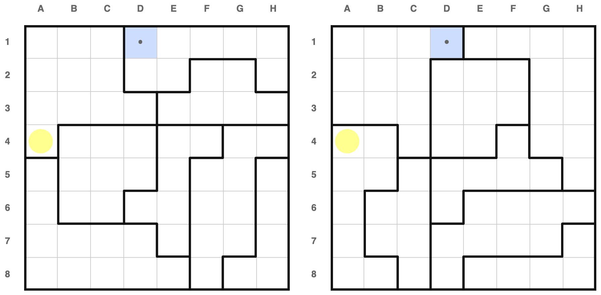</img> </a>

In this case, the two boards are diagonal reflections of one another. If the
solution wasn't symmetric along that reflection, then we could reflect it, and
have a second valid solution. But since we know the solution is unique, we can
infer that the reflection of every dot must be a dot, and the reflection of
every star must be a star. In this case, we've placed a dot at D1, and that
tells us that there must also be a dot at A4.

---

<a
href="https://joshmermelstein.com/multiverse-star-battle?book=armory&puzzle=13">
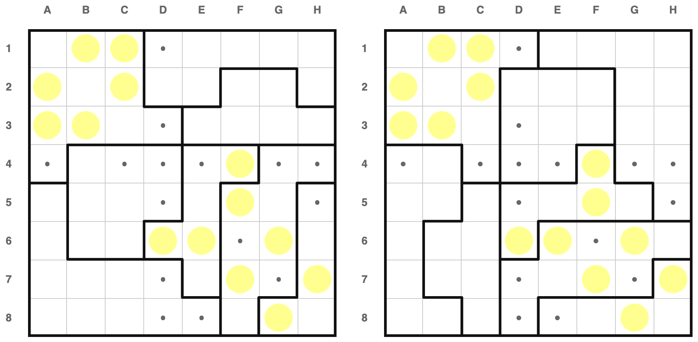</img> </a>

Let's keep looking at this puzzle, and take this line of thinking one step
further. Since the solution is symmetric, any cell which "sees" its own
reflection (by row/col/adjacency/region) cannot have a star.

For example, A3 and C1 are reflections of one another, so either both are dots
or both are stars. Those two cells are in the same region (on both boards), so
they cannot be stars, and must be dots.

---

<a
href="https://joshmermelstein.com/multiverse-star-battle?book=armory&puzzle=14">
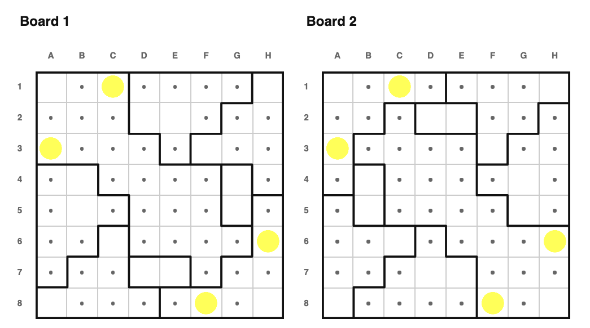</img> </a>

Here, both boards have diagonal self-symmetry. By the same logic above, this
means the solution must also have diagonal self-symmetry. This means we can
apply our diagonal-symmery rules here as well. The reflection of a dot is a dot,
the reflection of a star is a star, and any cell which "sees" itself under
diagonal reflection must be a dot.

I find this technique frustratingly powerful. It's easy to spot, and trivializes
many puzzles that would otherwise be very difficult.

#### Rot180

<a
href="https://joshmermelstein.com/multiverse-star-battle?book=armory&puzzle=15">
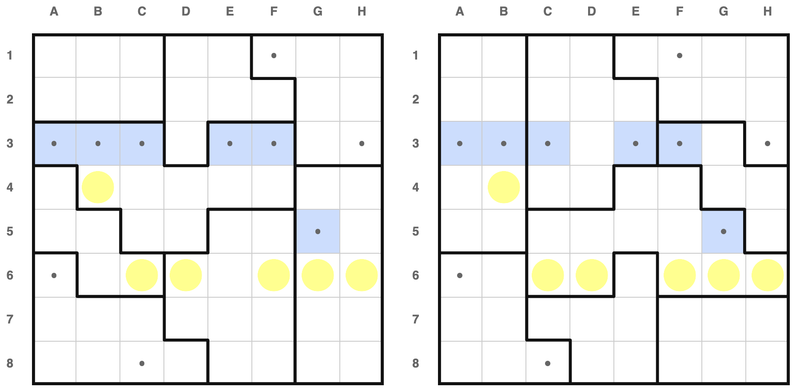</img> </a>

This puzzle has two boards that are 180 degree rotations of one another. The
solution must also have 180-degree symmetry, because otherwise we could rotate
the solution 180 degrees to get a second valid solution. So any time we place a
dot or star, we can also rotate that mark 180 degrees.

---

<a
href="https://joshmermelstein.com/multiverse-star-battle?book=armory&puzzle=15">
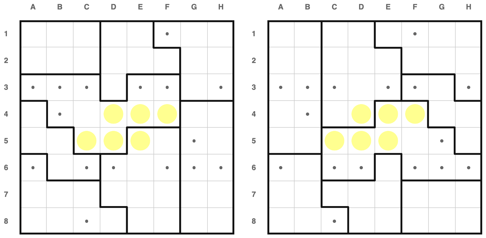</img> </a>

Again, we can take this further and consider every cell alongside its image
under 180 degree rotation. If the two "see" each other, including by being in
the same region, then they cannot be stars.

---

<a
href="https://joshmermelstein.com/multiverse-star-battle?book=armory&puzzle=16">
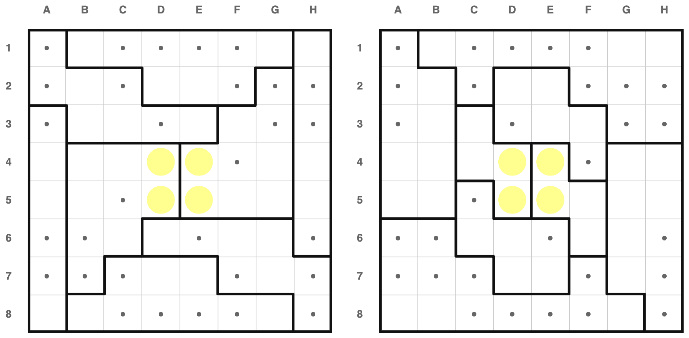</img> </a>

In this case, both boards have 180 degree self-symmetry, so the solution must
also have 180 degree symmetry. This means we can apply our 180 degree symmetry
rules here as well. The rotation of a dot is a dot, the rotation of a star is a
star, and any cell which "sees" itself under rotation must be a dot.

---

#### Rot 90

It feels like there ought to be a symmetry argument when one board is a 90
degree rotation of the other, but I haven't been able to think of one. If you
spot one, please let me know.

### Crossboard

<a
href="https://joshmermelstein.com/multiverse-star-battle?book=armory&puzzle=17">
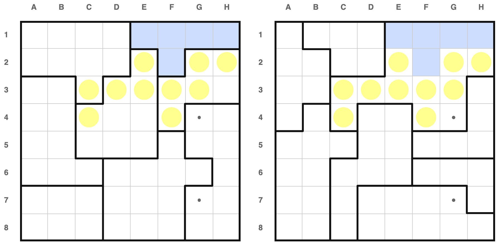</img> </a>

In this case, the top-right region of board 1 is a subset of the top-right
region of board 2. If we put a star in a non-shared cell of board 2, it would
make that region unsolvable on board 1. More generally, if any region is a
subset of another region, we can place dots in all cells of the larger region
which are not in the smaller region. This is my favorite technique.

---

<a
href="https://joshmermelstein.com/multiverse-star-battle?book=armory&puzzle=18">
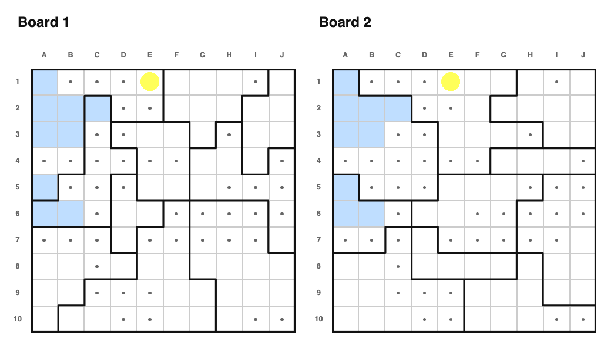</img> </a>

We can apply the same logic when one pair of regions is a subset of another
pair. This technique is quite rare, but I think it's really cool.  Fun fact,
there's a second place you can apply double-subset in this image.

---

<a
href="https://joshmermelstein.com/multiverse-star-battle?book=armory&puzzle=19">
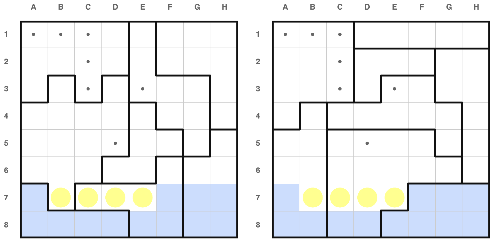</img> </a>

In this case, the bottom-left region of board 1 and the bottom-right region of
board 2 are disjoint, and are both contained in rows 7 and 8. No matter how we
place stars in those regions, we'll satisfy those rows, so we can mark the rest
of those rows with dots.

---

<a
href="https://joshmermelstein.com/multiverse-star-battle?book=armory&puzzle=20">
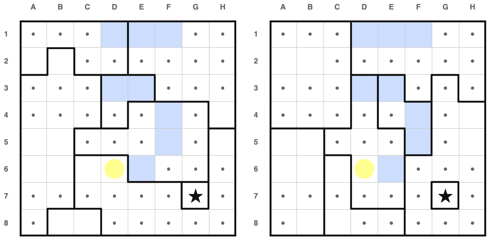</img> </a>

The same reasoning applies with >2 crossboard regions. In this case, the empty
cells of 3 regions (two from board 1, one from board 2) are all contained in
columns {D, E, F}.  So the rest of those columns must contain only dots.

---

<a
href="https://joshmermelstein.com/multiverse-star-battle?book=armory&puzzle=21">
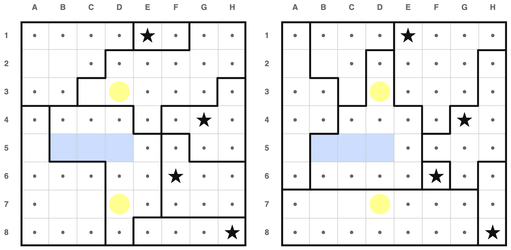</img> </a>

Focus on the regions containing blue cells on each board. They share 3 cells
{B5, C5, D5}, and each have one cell which is not shared (D3 and D7). If we put
the star in the non-shared cell of one, then we'd put dots in all shared cells,
and be forced to put a dot in the non-shared cell of the other. But in this
case, D3 and D7 see each other, so we aren't allowed to put stars in both.

More generally, if the non-shared cells of two regions all mutually see each
other, then we can put dots in all of them.

### Lookahead

<a
href="https://joshmermelstein.com/multiverse-star-battle?book=armory&puzzle=22">
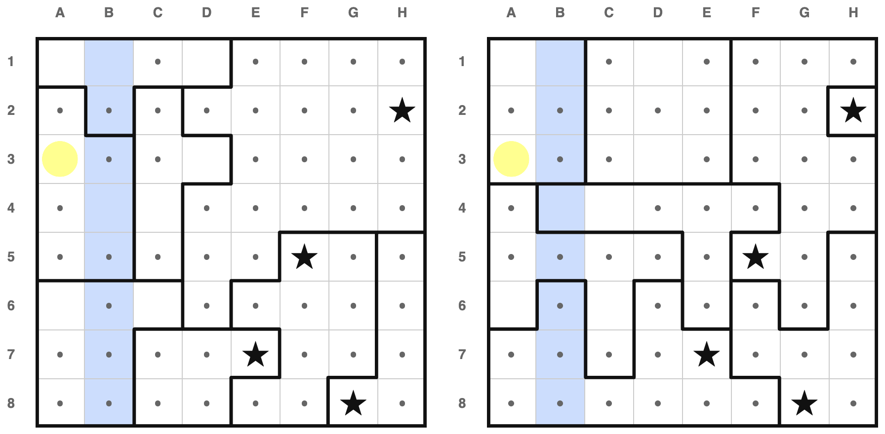</img> </a>

In this case, a star at B1 would see B4 (by column), and A3 (by region on board
2). This would make the middle-left region of board 1 unsolvable, so B1 cannot
contain a star. This is sorta like a generalized version of "sees too much", but
taking into account the region on the other board.

<a
href="https://joshmermelstein.com/multiverse-star-battle?book=armory&puzzle=23">
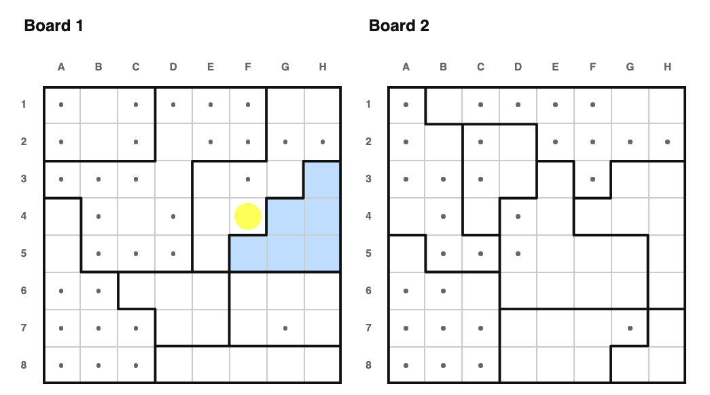</img> </a>

In this case, a star at D7 would force a dot at C5 (because of board 1 regions),
and E5 and F5 (because of board 2 regions). This makes row 5 unsolvable.

I call this "half-stage lookahead", because it's implemented in terms of the
multi-stage lookahead technique below.  This is the hardest kind of inference
that I still think of as "human viable" in the general case. And even then, I
only allow it in "expert" tier puzzles.

#### Multi-stage lookahead

This is the technique of last resort, sort like a guess-and-test.

<a
href="https://joshmermelstein.com/multiverse-star-battle?book=armory&puzzle=24">
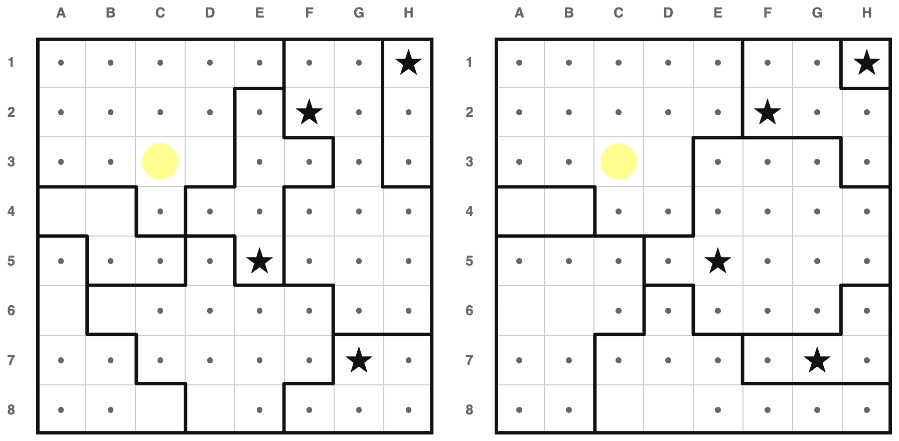</img> </a>

Consider a star at C3:

<a
href="https://joshmermelstein.com/multiverse-star-battle?book=armory&puzzle=24">
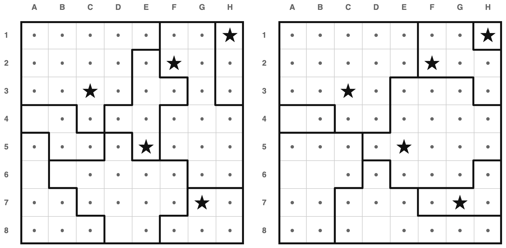</img> </a>

This forces the following dots. There are now two regions with one empty cell
apiece, so we need to place stars in A4 and A6. But those two are in the same
column, so C3 must contain a dot.

I think this technique is not viable for humans in the typical case, but can be
used in specialized cases.

## Unimplemented Techniques

### Implied region

There are lots of ways to notice an implied region, here's one. Maybe I'll add
more later

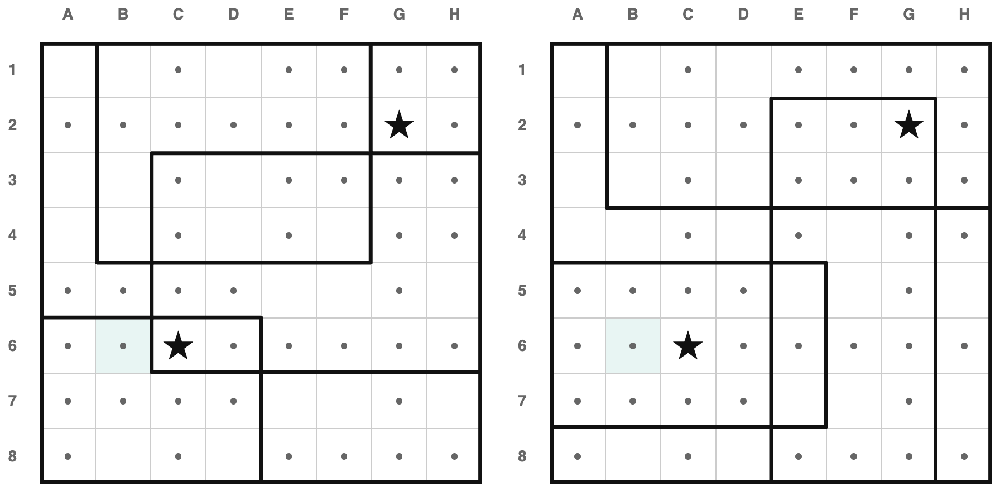</img>

TODO(jmerm): add to armory

Check out columns E+F of board 1. There is a trio of empty cells (F4, E5, F5),
and a pair of empty cells in (E7, F7). Each cluster must contain one star. So we
can treat the E7+F7 pair like a region, and eliminate H7.

I haven't figured out how to write this technique for the solver yet. All my
techniques for pointing out implied regions are too vague.

### Both-or-Neither

This is a technique I see a teammate use sometimes. He'll point out two cells
that must be equal, then say ~"oh, but if both are stars, then there's a
contradiction", and mark dots in both.

I think it's probably a special case of lookahead, but more human-viable.

## More philosophy

### Which puzzles are actaully good

The output of my solver is a "score" which estimates puzzle difficulty, and a
"tier", which says which kinds of rules were required. On my corpus of 1 million
8x8 puzzles, "beginner" ranges from 12-174, "medium"
difficulty puzzles range from 25-311, "hard" ranges from 39-367, "expert" ranges
from 92-1236, and "grandmaster" ranges from 145-3548.

Notice how the hardest beginner puzzle has a score higher than the easiest
grandmaster puzzle - what's up with that?! That beginner puzzle reqires a ton of
applications of beginner tier techniques, each one only placing a few dots at a
time. That grandmaster puzzle is trivial, except a crux which requires a
grandmaster tier technique.

Personally, I don't consider either to be suitable for publication. I
think that a beginner solver doesn't want a beginner puzzle like that, and an
expert/grandmaster solver also doesn't want a puzzle like that.

When I'm choosing which puzzles to publish, I throw away the puzzles with the
highest and lowest scores within each tier.

### Symmetry rules

I also have trouble characterizing the difficulty of puzzles that are
trivialized by the symmetry techniques. My current thinking is that I consider
the "copy notation along symmetry" as a medium tier technique. This gives those
puzzles a slight score decrease, because they can someteimes use this instead of
a harder technique. I consider the "sees
self under symmetry" as somewhere between "hard" and "expert". If a puzzle falls
into this category, I don't serve it at all.

### Branching Paths

In many cases, the same technique can be applied to multiple places on the
puzzle. Which one you choose can dramatically impact the solver's view of the
puzzle. I think this is especially noticable with the lookahead rules, since
they are difficult and place only a sinlge dot. A lucky use of lookahead might
trivialize the rest of the puzzle. An unlucky use of lookahead might require
several more applications of lookahead before the path becomes clear.

So what is the difficulty of that puzzle?

Perhaps I should run the solver several times, randomizing at all decision
points, and then look at the mean/median of all difficulty scores.

### Ideas for future improvement to scoring

 - how early does the first hard rule appear?
 - how early is the first star placed?
 - N row/cols along an edge is easier to spot than mid-board?
 - how often a solver of beginner/medium/... strength would need to switch
   boards
 - lookahead is expensive and not targeted. A good choice of lookahead might
   prevent the need for others. The same is true more generally if you think
   about it; maybe rules need to return a list of possible "Inference" objects
   and then the solver randomly selects amongst them?
 - split off a half-lookahead case which only requires looking at one board?
