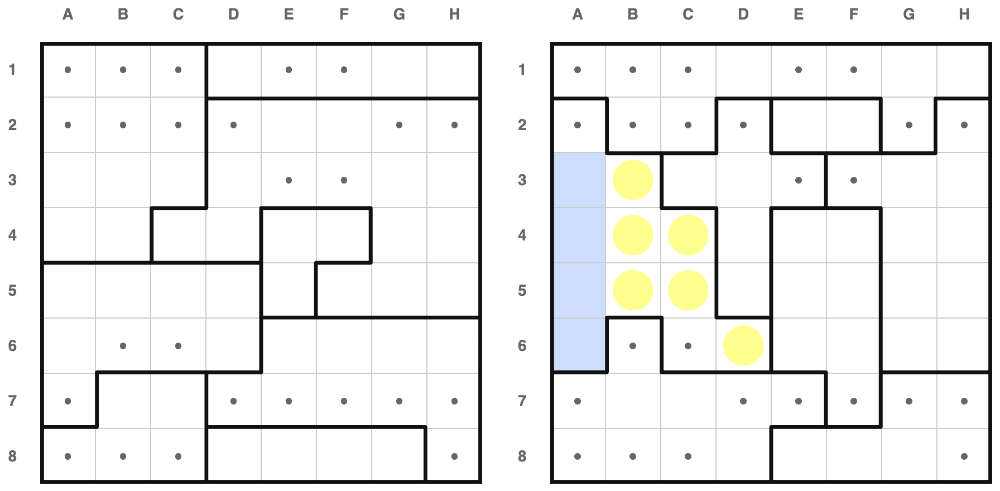
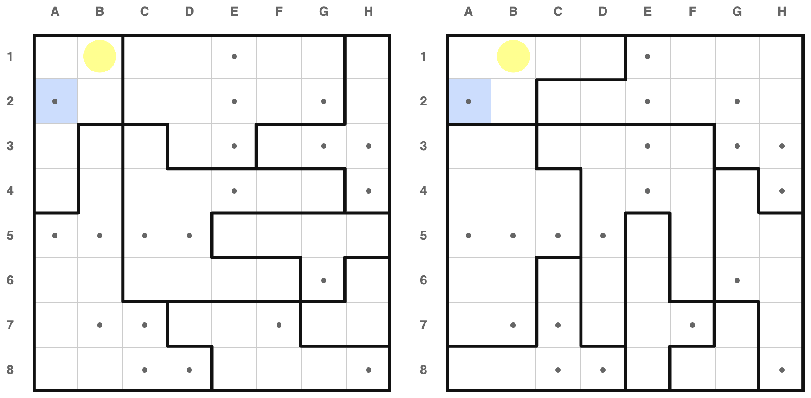
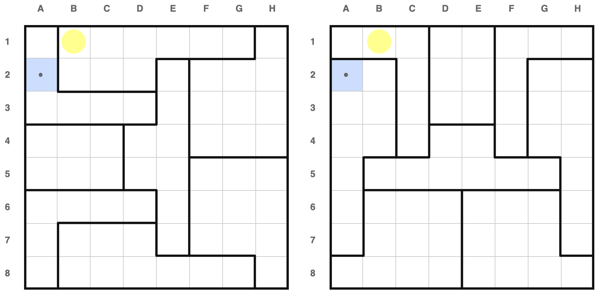
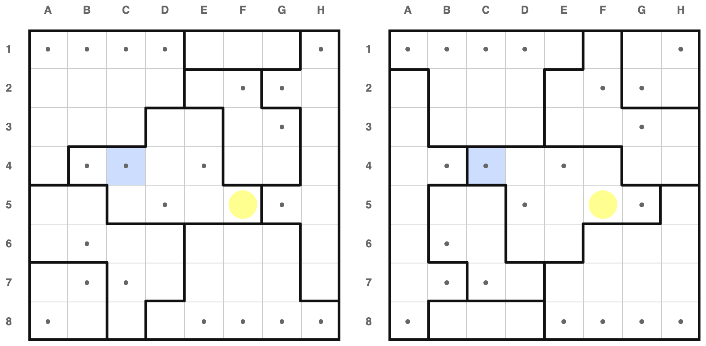
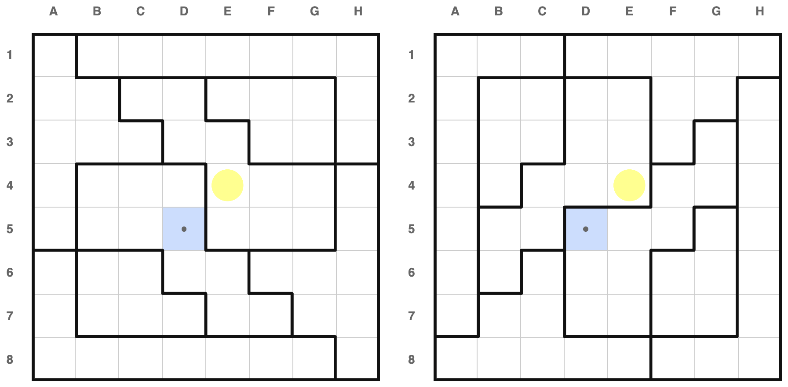
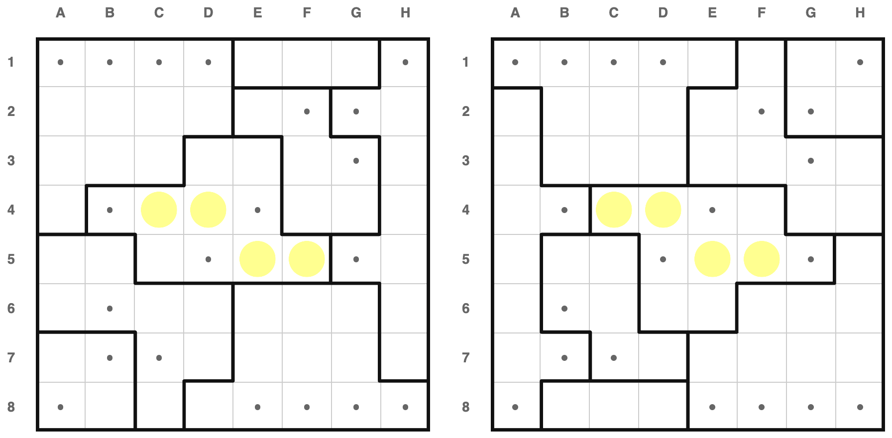
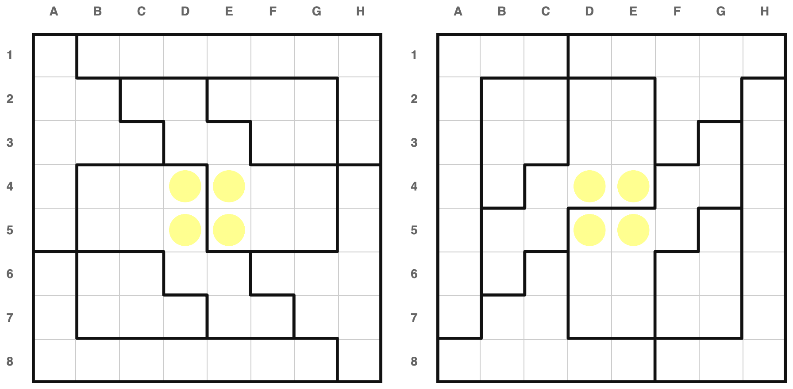
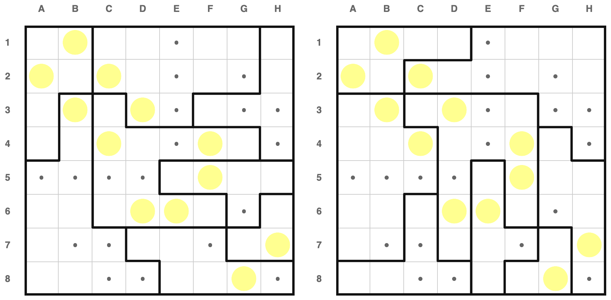
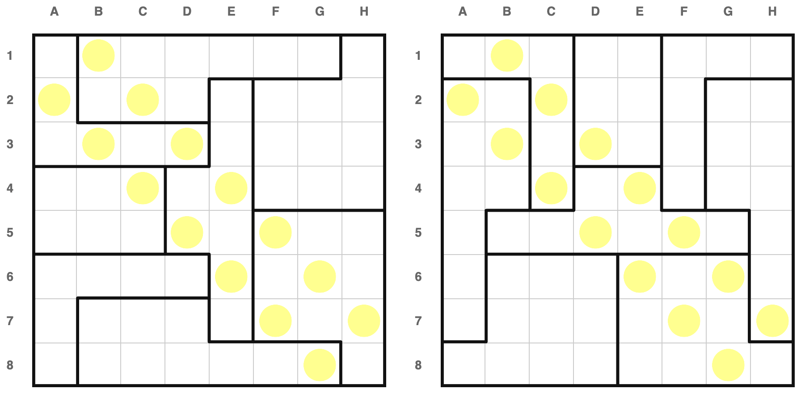
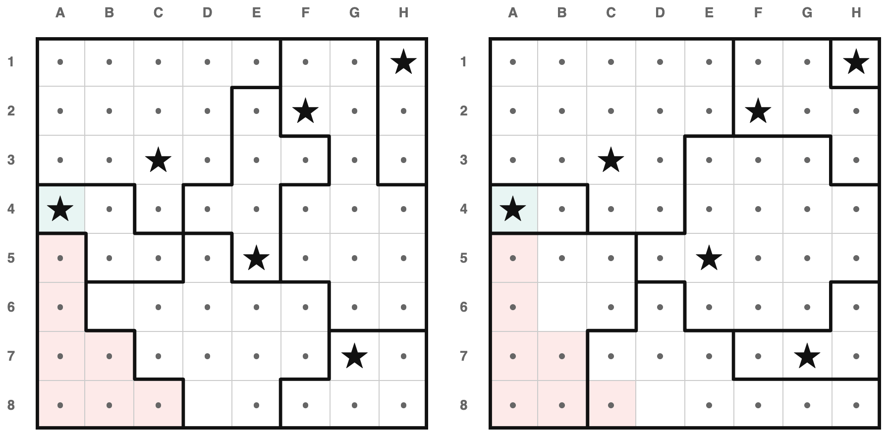

# How to Solve

This file is documents all the techniques that I use to solve multiverse star
battles. This is intended as a guide for new players, documentation for my hint
system, and as a place for me to ramble about difficulty.

## Philosophy

All of the "books" of puzzles that I publish were created in the same way:

1. Generate many more puzzles than I need
2. Rank them by difficulty
3. Filter the big set down to a smaller set

My ranking system is built around a big list of techniques, sorted by my opinion
about thier complexity. The computer solver iterates down the list and checks
whether each technique can apply to the current state of the puzzle. If so, it
add some dots/stars, and jumps back to the top of the list. This is intended to
mimic how a human solves these puzzles.

At the end, I have a trace of a possible path through the puzzle, and I can ask
questions like "what was the hardest technique that was required?" and "how many
total technqiques were applied?".

This is not an original idea. Before starting this project, I was vaguely aware
that this is how Sudoku is ranked. I was also directly inspired by KrazyDad's
video series, linked from the readme.

## The hint system is the ranking system

As I built my list of rules, I needed to constantly ask myself - "is there a
simpler move that the one the computer chose here?". I sometimes found the text
descriptions difficult to visualize, so I used AI to re-implement the solver in
javascript, and integrated it into the gui. This turned into the "hint" feature.

## Techniques

### Only empty

If a region has only one empty square then that square must be a star.

</img>

### Sees star

If a cell is in the same row/col/region as a star, then that cell must hold a
dot.

</img>

### Domino

If a pair of adjacent cells must hold a star, that lets us place many dots. This
can apply because these are the only two empty cells left in a region, or
because these are the only two empty cells left in a row/col.

</img>

Fun fact - this puzzle can be solved using just "Only empty", "Sees Star", and
"Domino".

### Triomino

A similar rule applies when there are three empty cells in a row/col, and one of
the three must contain a star.

</img>

This rule also applies if the middle of the three contains a dot.

</img>

### One row/col

This technique applies to two similar cases.

A. If a region covers all empty cells in a row/col - the rest of that region
cannot possibly have a star. If it did, then the row/col would be unsolvabled.

</img>

B. If a region's empty cells are fully contained in a row/col, then the
remainder of that row/col cannot have a star. If it did, the region would be
unsolvable.

</img>

</img>

### Sees too much

If any cell "sees" (by row/col/adjacency) all empty cells of a region/row/col,
then that cell must hold a dot. Otherwise the region/row/col would be
unsolvable.

For scoring, I break this rule into 3 cases.

1. The region has 2 empty cells.
2. The region has 3 empty cells.
3. The region has 4 or more empty cells.

</img>

This is intended to reflect the way I solve. I usually look at regions with very
few empty cells first.

Also note that Domino is a special case of this rule. Many of my rules are
special cases of each other :)

### 2 adjacent rows/cols

This is similar to "One row/col", but look at a pair of adjacent rows. It also
comes in two flavors.

A. If a pair of regions covers all empty cells in a pair of adjacent rows/cols -
the rest of those regions cannot possibly have a star. If it did, there wouldn't
be room to satisfy both regions.

</img>

B. If a pair of region's empty cells are fully contained in 2 adjacent
rows/cols, then the remainder of those rows/cols cannot have a star. If it did,
those regions wouldn't both be solvable.

</img>

### Diagonal fill

Sometimes we can tell, just from the structure of the boards, that the solution
will have symmetry across one of the diagonals. There are two cases that I know
of:

1. Both boards have symmetry along one of the diagonals
2. One board is the transpose of the other

In both cases, we take advantage of the fact that the solution is unique. If
the unique solution didn't have diagonal-reflection symmetry, we could reflect
it across the diagonal, and we'd have a different valid solution to the puzzle.

So, any time we place a dot or star, we can also reflect that mark
across the diagonal.

</img>
</img>

### Rot180 fill

Similar to the above, sometimes we can tell that the solution must have
180-degree diagonal symmetry. There are two cases that I know of:

1. Both boards have 180 degree rotaitonal symmetry
2. The two boards are 180 degree rotations of one another

In both cases, we take advantage of the fact that the solution is unique. If the
unique solution didn't have 180 degree rotation symmetry, we could rotate it 180
degrees, and we'd have a different valid solution to the puzzle.

So any time we place a dot or star, we can also rotate that mark 180 degrees.

</img>
</img>

### 3 Adjacent rows/cols

This is just like "1 row/col" and "2 Adjacent rows/cols", but applied to groups
of 3 adjacent rows/cols. Like those, it comes in two flavors.

A. If a group of 3 regions covers all empty cells in a trio of adjacent rows/cols -
the rest of those regions cannot possibly have a star. If it did, there wouldn't
be room to satisfy both regions.

</img>

B. If a group of 3 region's empty cells are fully contained in 3 adjacent rows/cols,
then the remainder of those rows/cols cannot have a star. If it did, those
regions wouldn't both be solvable.

</img>

### 2 Disjoint rows/cols

This is the same as "2 Adjacent rows/cols", but we drop the requirement that the
rows be adjacent. This makes these cases harder to spot (and more rare). Like
those, it comes in two flavors.

</img>
</img>

### Many adjacent rows/cols

Generalizing "3 Adjacent rows/cols", looks at any number of adjacent rows and
cols. On this board, the A and B flavors make the same observation.

</img>
</img>

### Regions contins regions

This is my favorite rule. If one region is a subset of another, then the star
must be in the smaller one. Otherwise the smaller one would be unsolvable.

</img>

### Rot180 symmetry

As mentioned above, there are times when we know that the solution will have 180
degree rotation symmetry. If so, we can place dots in any cell that "sees"
iteslf under 180 degree rotation.

</img>
</img>

### Diagonal symmetry

As mentioned above, there are times when we know that the solution will have
reflection symmetry across a diagonal. If so, we can place dots in any cell that
"sees" iteslf under diagonal reflection

</img>
</img>

### 3 disjoint rows/cols

Like "2 disjoint rows/cols" but we look at groups of 3 rows/cols at once.

</img>
</img>

### 2 regions crossboard

When a pair of regions are disjoint, and are fully contained in the same two
rows/cols, we can place a dot everywhere else in those two rows/cols.

</img>

### 3 regions crossboard

Same as the above, but looking at groups of three regions.

</img>

### Crossboard partial overlap

If two regions mostly overlap, and the non-overlapping cells all see each other
(e.g. share a column), then the star must be in the overlapping part.

</img>

### Half-stage lookahead

Speculatively place a star, see if any rows/cols/regions are completely filled
with dots afterward.

</img>

### region pair contains pair

Like region-contains-region, but looking at pairs of regions.

</img>

fun fact, there's a second double-subset in this image.

### Lookahead

Like "Half-stage lookahead", but after placing all dots implied by the
speculative star, keep going. Place all stars force by only-empty, then place
all dots implied by _those_ stars. I think this rule is impractical for humans
except in very special cases.

Consider a star at C3:
</img>

This forces the following dots, which forces a star at A4.

</img>

But placing the A4 star makes one region on board 1 unsolvable.

</img>

## Unimplemented Rules

### Implied region

There are lots of ways to notice an implied region, here's one. Maybe I'll add
more later

</img>

Check out columns E+F of board 1. There is trio of empty cells (F4, E5, F5), and
a pair of empty cells on (E7, F7). Each cluster must contain one star. So we can
treat the E7+F7 pair like a region, and eliminate H7.

I haven't figured out how to write this rule for the solver yet. All my
techniques for pointing out implied regions are too vauge.

### Both-or-Neither

This is a technique I see a teammate use sometimes. He'll point out two cells
that must be equal, then say ~"oh, but if both are stars, then there's a
contradiction", and mark dots in both.

I think it's probably a special case of lookahead, but more human-viable.

## More philosophy

- symmetry
- how many applications of a hard rule are required?
- which levels are worth publishing
- ideas for future improvement to the scoring system

TODO(jmerm): link to levels in bestiary.md
