# How to Solve, Part 2

This is the sequel to [how_to_solve.md](how_to_solve.md), covering puzzles that need
**more than one star per row, column, and region**. You don't need to have read the
first volume — this one stands on its own — but the two documents were written in
the same spirit: a catalog of the techniques my hint system knows about, sorted
roughly by how hard I think each one is to spot.

Everything from the original document still applies once boards need more than one
star. Rows, columns, and regions still hold a fixed number of stars, stars still
can't touch, and puzzles are still ranked by simulating a human solver working down
a list of techniques from easiest to hardest. What's new is the combinatorics: once
a row can hold two or more stars instead of one, "this cell must be empty" and
"this cell must be a star" both get harder to spot, and a whole family of techniques
opens up that has no 1★ equivalent at all.

All of the example puzzles below live in the `armory2` book. Click any image to load
that exact puzzle and try it yourself. Every puzzle here was chosen so that mashing
the **Hint** button over and over is *guaranteed* to eventually need the technique
being illustrated — it's not just a technique that happens to work on this puzzle,
it's the single hardest technique the puzzle's solution actually requires. (For the
curious: I found these by re-running my own scorer's exact solve loop and recording
which named rule was the hardest one it ever needed — a more principled version of
the score-hacking I did for the original armory.)

## The rules of the puzzle, revisited

<a href="index.html?book=armory2&puzzle=1">
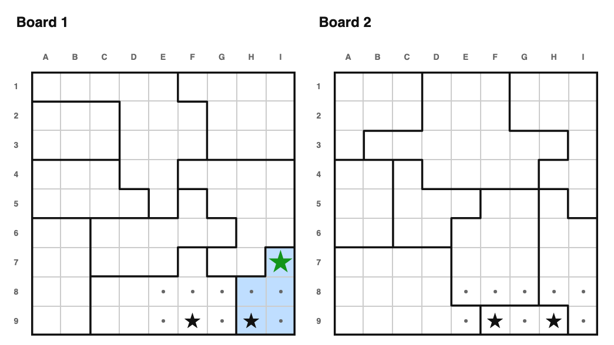</img> </a>

The core rule generalizes directly: every row, column, and region must contain
exactly `stars_per_unit` stars. So if a unit is still missing some stars, and has
*exactly* that many empty cells left, every one of those cells must be a star —
there's no other way to fit them in. Here, look at board 1's region made of H8, H9,
I7, I8, and I9, tucked into the corner: it needs one more star, H9 already has one,
H8/I8/I9 are already dots, and I7 is the only cell left — so I7 must be the star.
This is the direct 2★+ generalization of "only empty" from the first volume, which
was really just this rule's `N=1` case.

(Getting to this exact moment took one earlier move I haven't explained yet: on
board 2, those same physical cells sit along the bottom edge as a different, smaller
region — just F9, G9, and H9 — which needs 2 stars of its own. Since the middle cell
touches both of its neighbors, the only way to fit 2 non-touching stars in three
cells in a row is to skip the middle one, so F9 and H9 are forced to be stars
together. That's a preview of Unit Placement Forced, up next — trust it for now.
Ordinary adjacency then turns their neighbors, including H8, I8, and I9, into dots.)

---

<a href="index.html?book=armory2&puzzle=2">
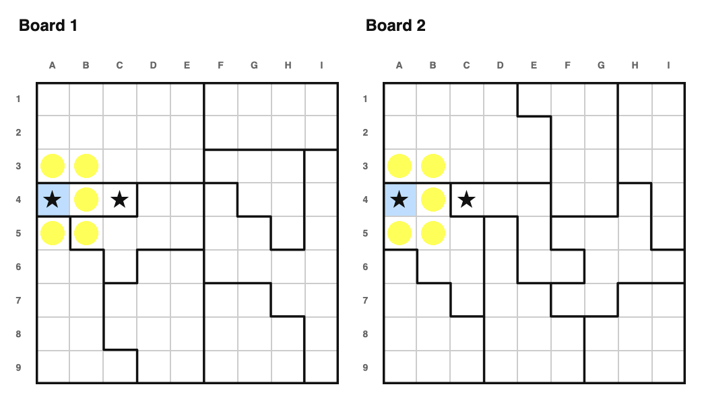</img> </a>

Stars still can't touch, even diagonally, regardless of how many stars share a
row/column/region. Here, A4 is already a star, so all five cells around it — A3, B3,
B4, A5, B5 — become dots at once. And once a unit reaches its *full* quota of stars,
not just "any" star, every other empty cell in it becomes a dot too. This is a small
but important shift from 1★, where "has a star" and "is finished" were the same
thing.

## Unit Placement Forced

This is the workhorse technique of 2★+ puzzles, and it doesn't have a clean 1★
analogue — with only one star per unit, "which cells could the star be in" was
trivial. With two or more, it isn't.

The idea: take a row, column, or region that's still missing some stars, and look
at every *valid* way to place its remaining stars in its remaining empty cells (two
stars can't be adjacent, so not every combination of cells works). Then ask:

- Is there a cell that's a star in **every** valid completion? If so, it must be a
  star — no matter which completion turns out to be the real one.
- Is there a cell that's a star in **no** valid completion, or that would touch a
  star in every valid completion? If so, it must be a dot.

<a href="index.html?book=armory2&puzzle=3">
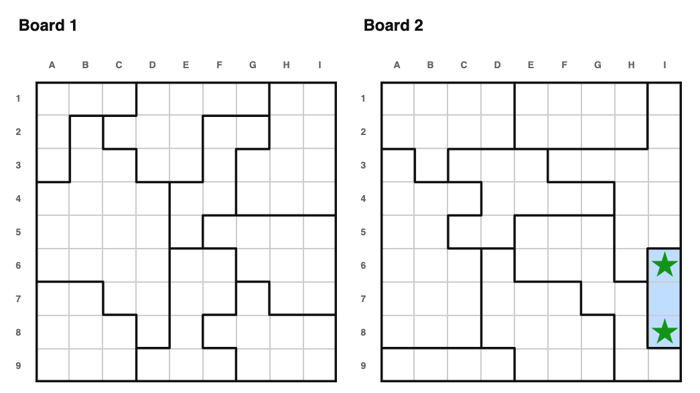</img> </a>

Look at board 2's rightmost region: just three cells, I6, I7, and I8, stacked
vertically. This puzzle needs 2 stars per region, and I6-I7 touch, and I7-I8 touch —
so the only way to fit 2 non-touching stars in these three cells is to skip the
middle one. I6 and I8 must both be stars. (I7 then becomes a dot on the very next
move, once ordinary adjacency catches up to it — but this rule got there first.)

---

<a href="index.html?book=armory2&puzzle=4">
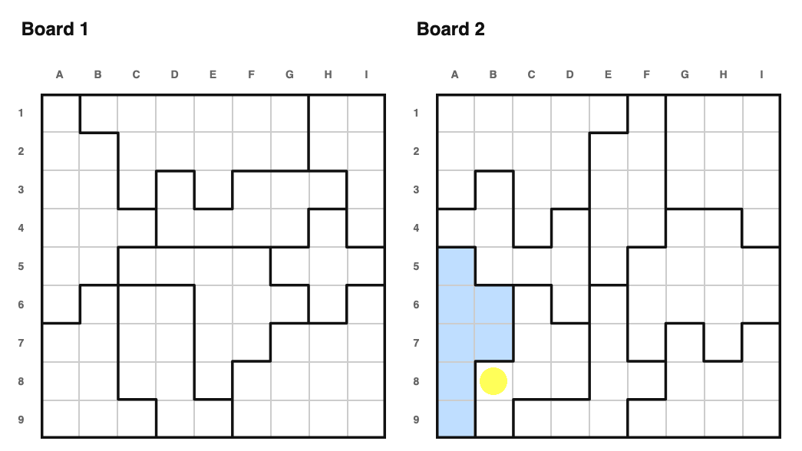</img> </a>

The same reasoning finds dots, too — both inside the unit in question, and in cells
just outside it that every valid completion's stars would touch. Here, the
highlighted region's five cells form a diamond around H5: H4, G5, I5, and H6 surround
it, and every one of them touches H5. The region needs 2 non-touching stars, and the
only two non-touching pairs available are {H4, H6} and {G5, I5} — so H5, which
touches all four of the others, can never be one of the two stars, and must be a dot.
The same logic reaches outside the region too: G4 and I4 each touch H4 (one candidate
pair) as well as G5 or I5 respectively (the other candidate pair), and G6 and I6
similarly each touch H6 and their nearer side-cell — so no matter which pair turns
out to be the real one, all four are touching a star, and all four must be dots.

---

My hint system actually checks this in three passes of increasing thoroughness,
because fully enumerating every valid completion of a large region can get
expensive:

- **Weak**: only rules out completions where two of the unit's own cells touch each
  other. Fast, catches most cases.
- **Intermediate**: also rules out completions that would overload some other
  row/column/region *on the same board*.
- **Strong**: also accounts for regions on *other* boards — the full, most
  expensive check.

<a href="index.html?book=armory2&puzzle=5">
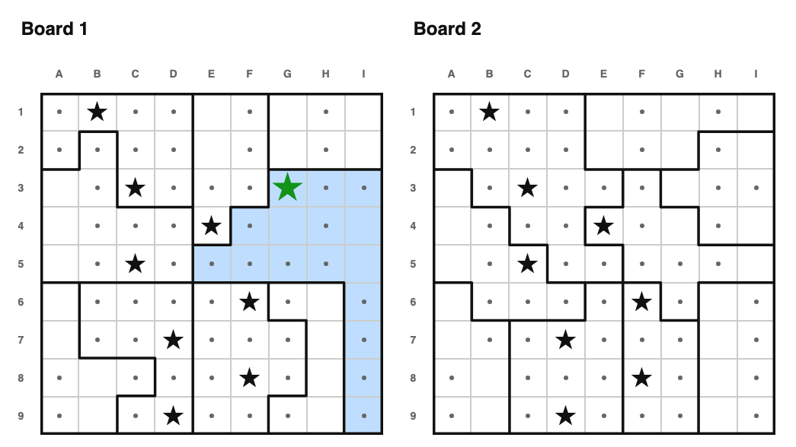</img> </a>

This example specifically needs the "strong" level: G3 only turns out to be forced
once you account for how tightly other rows, columns, and regions *on both boards*
are already boxed in — the "weak" and "intermediate" passes alone can't see it.

## Tiles

Tiles aren't actually new to 2★+ — they're covered in
[the first volume](how_to_solve.md) too — but they get more mileage here, since a
unit needing several stars gives them more room to work with. Take any 2×2 block of
cells. No matter which of its cells are still empty, that block can **never** hold more than one
star — every cell in a 2×2 block touches every other cell, even diagonally.

Now look at a pair of adjacent rows (or columns) that's still missing, say, 3 stars.
If the empty cells in that pair can be cleanly split into exactly 3 non-overlapping
2×2 "tiles", then — since no tile can hold more than 1 star, and we need exactly 3
stars from exactly 3 tiles — pigeonhole tells us **every single tile** must hold
*exactly* one star, not just "at most" one.

<a href="index.html?book=armory2&puzzle=6">
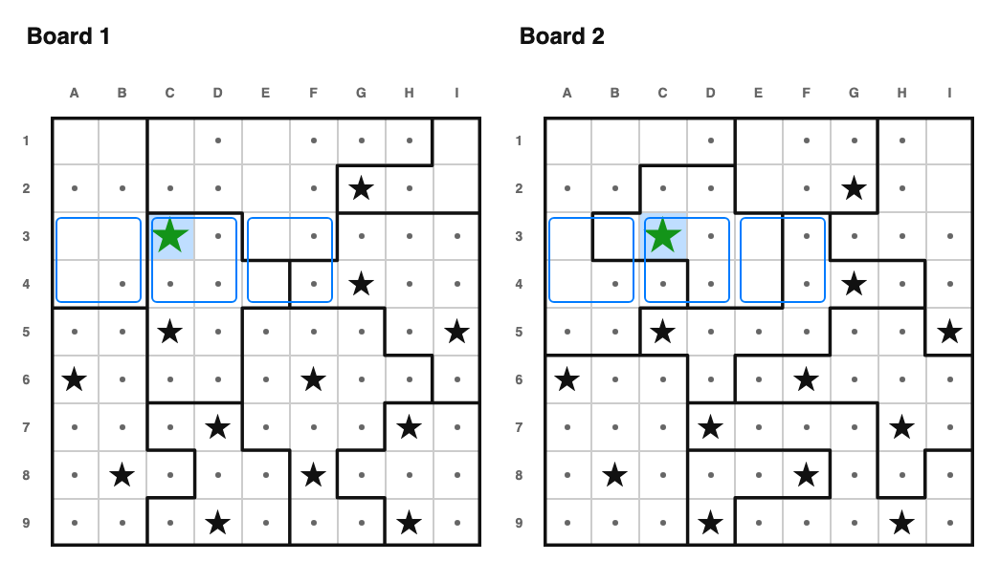</img> </a>

Here, a row-pair still needs 3 stars, and splits cleanly into exactly 3 tiles — one
of which has only a single empty cell left (C3). Since that tile is guaranteed
exactly one star, and it only has room for one candidate, C3 must be the star.

---

<a href="index.html?book=armory2&puzzle=7">
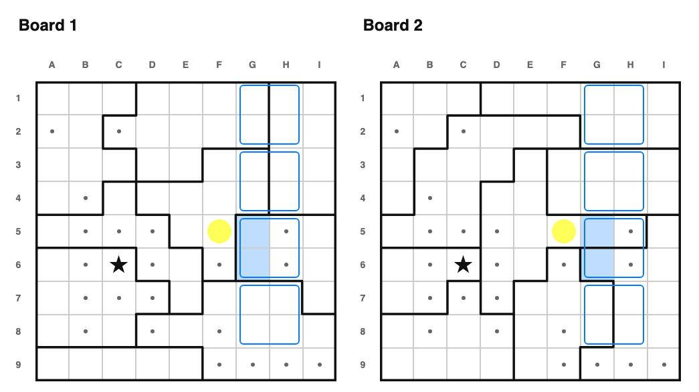</img> </a>

A confirmed tile with exactly two empty cells holds exactly one star, but we don't
know which of the two. Even so, any other cell that touches **both** of them can
still be dotted — whichever of the two ends up with the star, it would touch that
cell either way. That's what rules out F5 here.

---

<a href="index.html?book=armory2&puzzle=8">
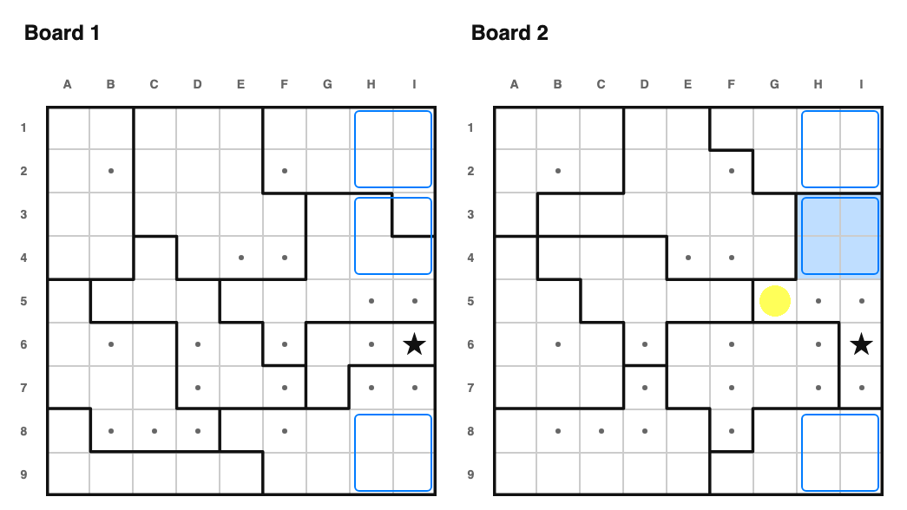</img> </a>

Confirmed tiles don't have to come from the same band to be useful. If a row,
column, or region still needs exactly `K` more stars, and you can find `K`
confirmed tiles that are all disjoint subsets of its remaining empty cells, those
tiles alone account for the unit's entire remaining quota — so every other empty
cell in that unit must be a dot. Here a single confirmed tile already covers a
region's entire remaining need (K=1), so G5 — a cell in that region but outside the
tile — must be a dot.

---

<a href="index.html?book=armory2&puzzle=9">
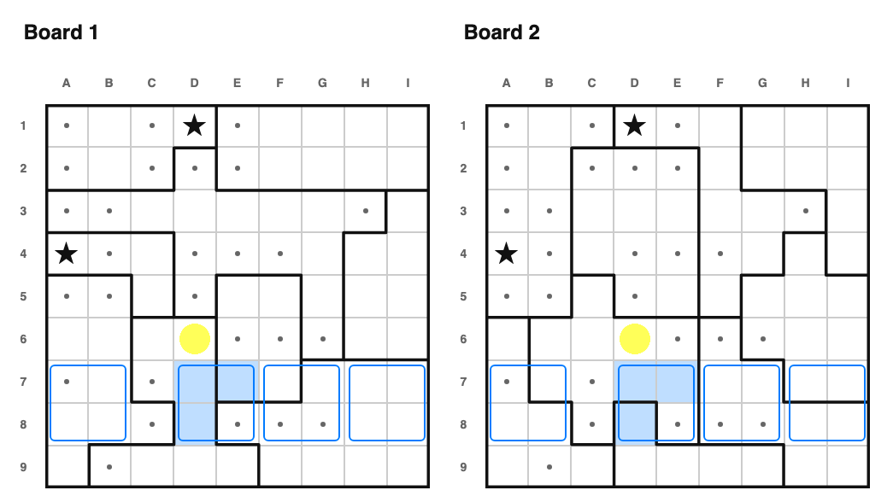</img> </a>

Just like the 1★ "sees too much" technique, if every cell of a confirmed tile
"sees" some other cell — either by touching it directly, or because that
particular placement would complete a row or column and leave no room for anything
else — that other cell must be a dot. That's D6's fate here: no matter which of the
tile's cells ends up holding the star, D6 is ruled out either way.

There are a couple of even more advanced tile techniques — combining confirmed
tiles from two *unrelated* bands that happen to overlap the same row-pair or
column-pair window ("tile pair quota fill"), and finding a partial, not-quite-
complete tiling with one leftover strip that still guarantees something ("tile bar
trapped"). I've verified both are sound, but they're rare enough, and subtle
enough to explain, that I don't have dedicated examples for them here.

## Adjacent and disjoint rows/cols, revisited

The 1★ "adjacent rows/cols" and "disjoint rows/cols" techniques generalize
directly, with one wrinkle: instead of comparing a *count* of regions to a *count*
of rows/columns, you have to compare their *summed remaining star need*, since a
region or a row can need more than one star now.

<a href="index.html?book=armory2&puzzle=10">
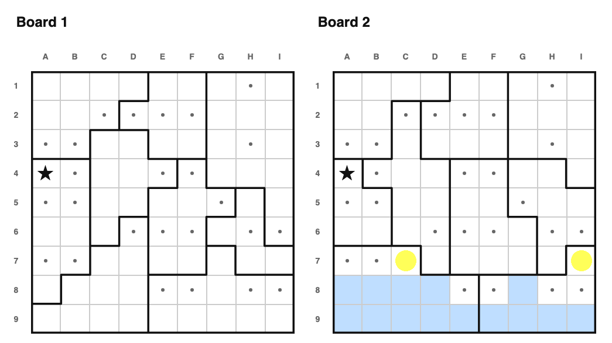</img> </a>

Here, two adjacent rows still need 4 stars between them, and the highlighted
region(s) confined to those rows need exactly 4 stars themselves — so those regions
must be supplying the rows' entire quota, and the rest of those rows' cells (C7 and
I7, outside the highlighted regions) must be dots.

I don't have a small, clean example of the *disjoint* (non-adjacent) version handy
right now — it's the exact same idea, just applied to rows or columns that aren't
next to each other, the same way the original document's disjoint-rows section
followed its adjacent-rows section.

## Region/Line Quota Fill

This is the other big new idea in 2★+ puzzles, and it builds directly on Unit
Placement Forced above. Sometimes a region's remaining stars aren't fully confined
to one row or column, but every one of its valid completions still puts *at least*
some number of stars in a particular row or column anyway. That's a "guarantee" —
something you can bank on regardless of which completion is real.

<a href="index.html?book=armory2&puzzle=11">
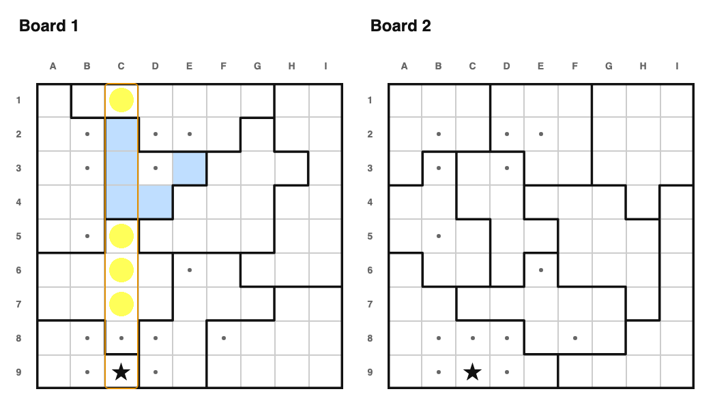</img> </a>

The amber-outlined column here needs exactly 1 more star. The highlighted region
is guaranteed to place at least 1 star in that column no matter how its own
remaining cells resolve — and since that alone already covers the column's whole
remaining need, every other empty cell in the column (C1, C5, C6, C7) must be a dot.
(With more than one region involved, you'd add up several regions' guarantees to
hit the line's quota — this example just happens to need only one.)

---

<a href="index.html?book=armory2&puzzle=12">
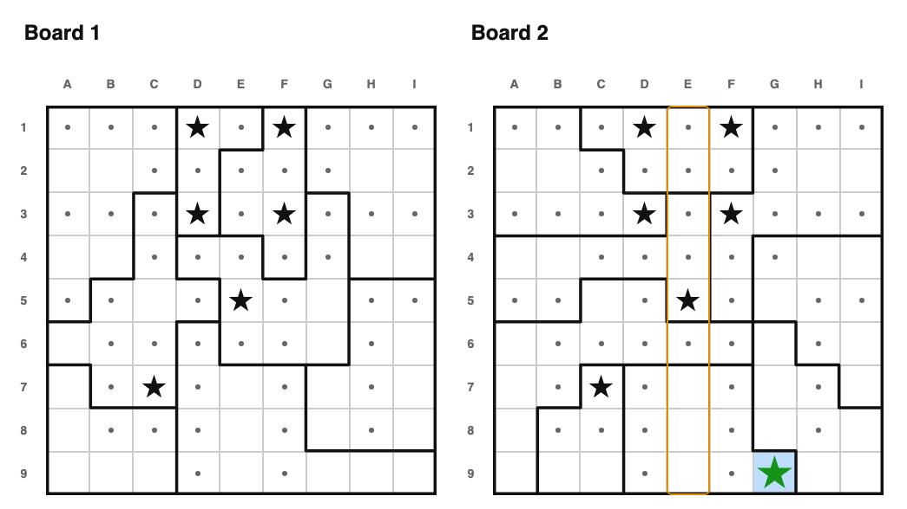</img> </a>

Two siblings of this idea are worth a mention. Once a region's contribution to a
line is pinned to an exact count (like the column above), you can treat its
remaining cells — split into "in the line" and "everywhere else" — as their own
small, self-contained puzzles. Here, the highlighted region must place exactly 1
star in the amber column, which pins its *other* remaining star to the rest of the
region; every valid way to place that one star happens to agree on G9, so G9 must
be a star ("partition forced"). The other sibling ("partition trapped") runs the
same idea in reverse: if a region is proven to place at least a few stars among a
fixed set of its own cells, any outside cell touching *all* of them can be dotted,
without needing to know exactly which cell gets the star.

## Symmetry, revisited

The symmetry techniques from the first volume still apply, with one adjustment.
For 1★ puzzles, if a cell and its mirror image shared any row/column/region, that
was always a contradiction — a 1★ unit only ever holds one star, period. For 2★+,
sharing a unit is only a problem if that unit has **one or fewer** stars left to
place; if it still needs two or more, both the cell and its mirror can happily be
stars in it at once.

I don't have a good small example of this one yet — a genuinely symmetric pair of
boards is already a rare coincidence to generate on purpose, and I haven't found
one small enough to be worth screenshotting for this document. If you run across a
2★+ puzzle in the wild that needs this, let me know.

## Unit completion satisfies other unit

Another technique with no 1★ analogue. Enumerate every valid way to place a unit's
remaining stars, same as above — but this time, check whether **every single one**
of those completions happens to exactly fill up the entire remaining quota of some
*other* row, column, or region too. If so, that other unit's quota is guaranteed to
come entirely from this unit, no matter which completion is real — so any of that
other unit's cells that lie *outside* this one must be dots. I don't have a compact
example of this one yet either; it turned out to be one of the rarer techniques
in my test puzzles.

## Crossboard, revisited

<a href="index.html?book=armory2&puzzle=13">
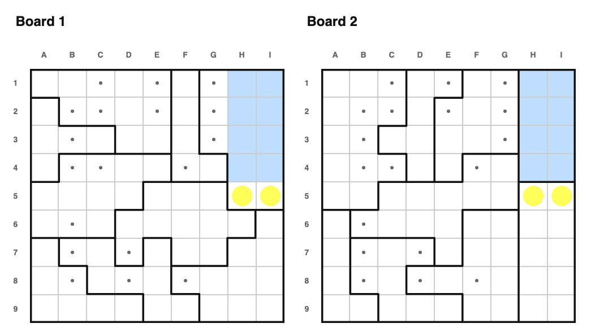</img> </a>

"Region contains region" generalizes the same way adjacent-rows did: instead of
comparing region *counts*, compare their summed remaining need. Here, a region on
board 2 needs exactly as many stars as a region on board 1, and every one of its
open cells is also open in board 1's region — so the extra cells in board 1's
region (H5 and I5) must be dots.

Crossboard region-pinning and crossboard partial-overlap both generalize the same
way (summed need instead of raw counts, and adjacency instead of "sees" for partial
overlap specifically) — I just don't have small, clean examples of either handy for
this document yet.

## Lookahead

<a href="index.html?book=armory2&puzzle=14">
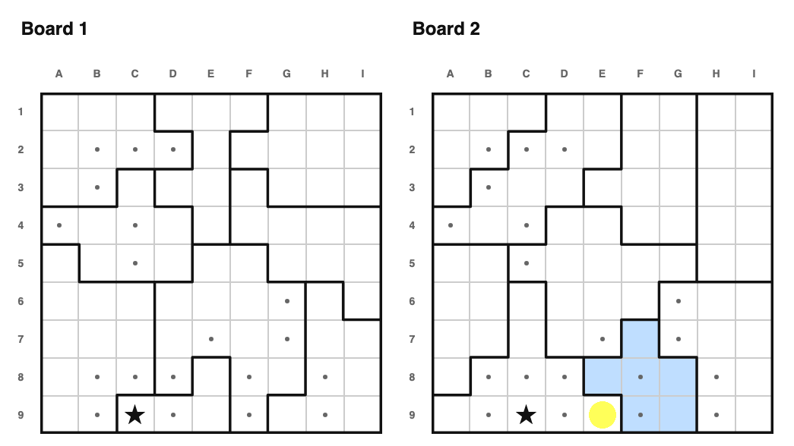</img> </a>

Same idea as the first volume's half-stage lookahead: hypothesize a star at some
cell, propagate the immediate consequences (adjacency, filled units, only-empty),
and see if it breaks the board. Here, a star at the circled cell would leave the
blue cells' unit unable to reach its required star count — so the circled cell must
be a dot.

I also have a multi-stage version of this — repeating the propagation for several
rounds instead of just one — generalizing the first volume's "technique of last
resort." It's implemented, but disabled in the live scorer for performance (a full
board-wide speculative sweep, repeated per stage, gets slow fast at 3★+ scale), so
it can never actually be the hardest rule a real generated puzzle needs. No example
here, for the same reason: it doesn't even get the chance to run.

---

I suspect there are more human-viable 2★+ rules I haven't found yet, and I'd like
to fill in the handful of techniques above that don't have examples yet once I find
(or generate) clean small puzzles for them. If you think of one — or spot a good
candidate puzzle — let me know, same as the original document.
