# How to Solve, Part 2

This is the sequel to [how_to_solve.md](how_to_solve.md), covering puzzles that need
**more than one star per row, column, and region**. You don't need to have read the
first volume — this one stands on its own — but the two documents were written in
the same spirit: a catalog of the techniques my hint system knows about, sorted
roughly by how hard I think each one is to spot.

Everything from the original document still applies once boards need more than one
star. Rows, columns, and regions still hold a fixed number of stars, stars still
can't touch, and puzzles are still ranked by simulating a human solver working down
a list of techniques from easiest to hardest. What's new is the combinatorics: once
a row can hold two or more stars instead of one, "this cell must be empty" and
"this cell must be a star" both get harder to spot, and a whole family of techniques
opens up that has no 1★ equivalent at all.

All of the example puzzles below live in the `armory2` book. Click any image to load
that exact puzzle and try it yourself. Every puzzle here was chosen so that mashing
the **Hint** button over and over is *guaranteed* to eventually need the technique
being illustrated — it's not just a technique that happens to work on this puzzle,
it's the single hardest technique the puzzle's solution actually requires. (For the
curious: I found these by re-running my own scorer's exact solve loop and recording
which named rule was the hardest one it ever needed — a more principled version of
the score-hacking I did for the original armory.)

## The rules of the puzzle, revisited

<a href="index.html?book=armory2&puzzle=1">
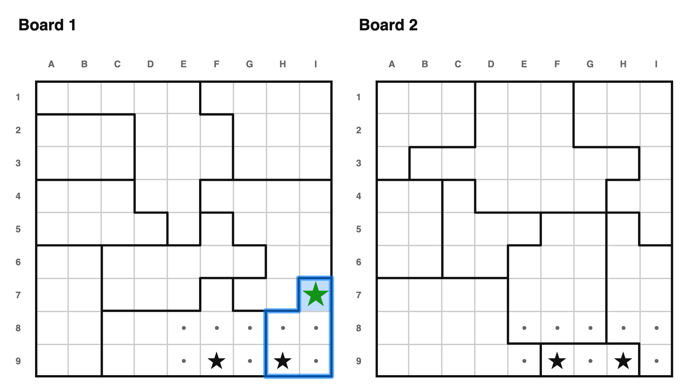</img> </a>

The core rule generalizes directly: every row, column, and region must contain
exactly `stars_per_unit` stars. So if a unit is still missing some stars, and has
*exactly* that many empty cells left, every one of those cells must be a star —
there's no other way to fit them in. Here, look at board 1's region made of H8, H9,
I7, I8, and I9, tucked into the corner: it needs one more star, H9 already has one,
H8/I8/I9 are already dots, and I7 is the only cell left — so I7 must be the star.
This is the direct 2★+ generalization of "only empty" from the first volume, which
was really just this rule's `N=1` case.

(Getting to this exact moment took one earlier move I haven't explained yet: on
board 2, those same physical cells sit along the bottom edge as a different, smaller
region — just F9, G9, and H9 — which needs 2 stars of its own. Since the middle cell
touches both of its neighbors, the only way to fit 2 non-touching stars in three
cells in a row is to skip the middle one, so F9 and H9 are forced to be stars
together. That's a preview of Unit Placement Forced, up next — trust it for now.
Ordinary adjacency then turns their neighbors, including H8, I8, and I9, into dots.)

---

<a href="index.html?book=armory2&puzzle=2">
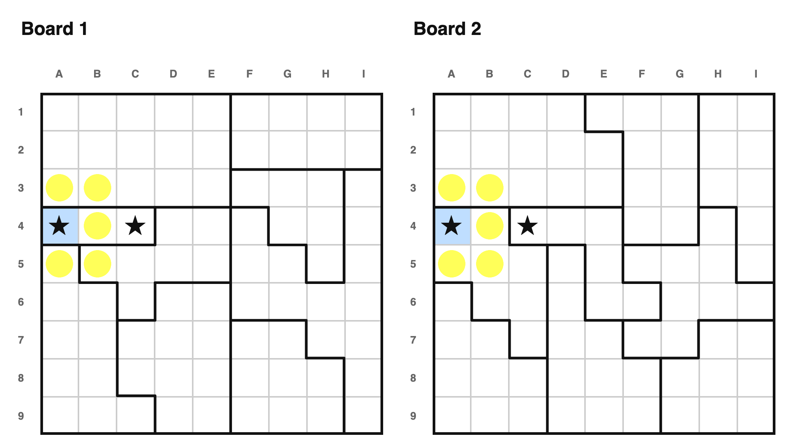</img> </a>

Stars still can't touch, even diagonally, regardless of how many stars share a
row/column/region. Here, A4 is already a star, so all five cells around it — A3, B3,
B4, A5, B5 — become dots at once. And once a unit reaches its *full* quota of stars,
not just "any" star, every other empty cell in it becomes a dot too. This is a small
but important shift from 1★, where "has a star" and "is finished" were the same
thing.

## Unit Placement Forced

This is the workhorse technique of 2★+ puzzles, and it doesn't have a clean 1★
analogue — with only one star per unit, "which cells could the star be in" was
trivial. With two or more, it isn't.

The idea: take a row, column, or region that's still missing some stars, and look
at every *valid* way to place its remaining stars in its remaining empty cells (two
stars can't be adjacent, so not every combination of cells works). Then ask:

- Is there a cell that's a star in **every** valid completion? If so, it must be a
  star — no matter which completion turns out to be the real one.
- Is there a cell that's a star in **no** valid completion, or that would touch a
  star in every valid completion? If so, it must be a dot.

<a href="index.html?book=armory2&puzzle=3">
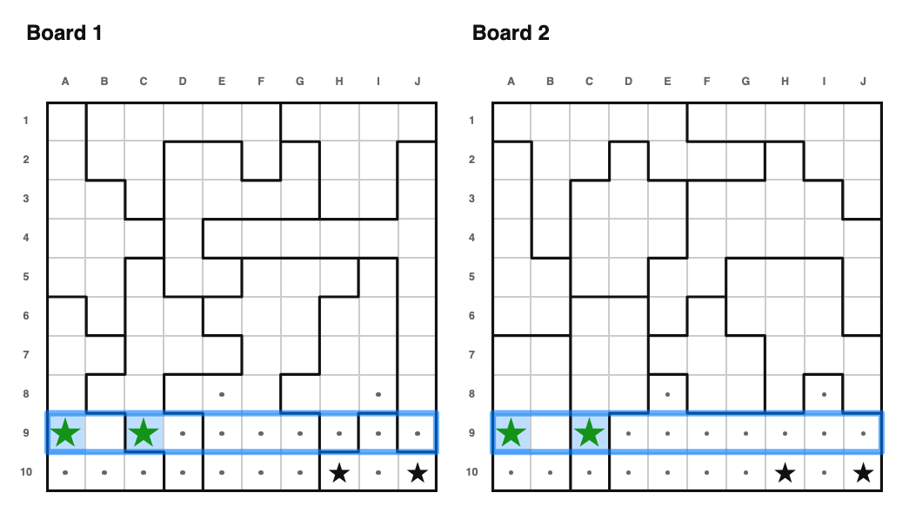</img> </a>

Look at row 9: it needs 2 stars, and everything in it except A9, B9, and C9 is
already a dot. Those three sit in a straight run, A9 touches B9, and B9 touches C9 —
so the only way to fit 2 non-touching stars in these three cells is to skip the
middle one. A9 and C9 must both be stars. (B9 then becomes a dot on the very next
move, once ordinary adjacency catches up to it — but this rule got there first.)

---

<a href="index.html?book=armory2&puzzle=4">
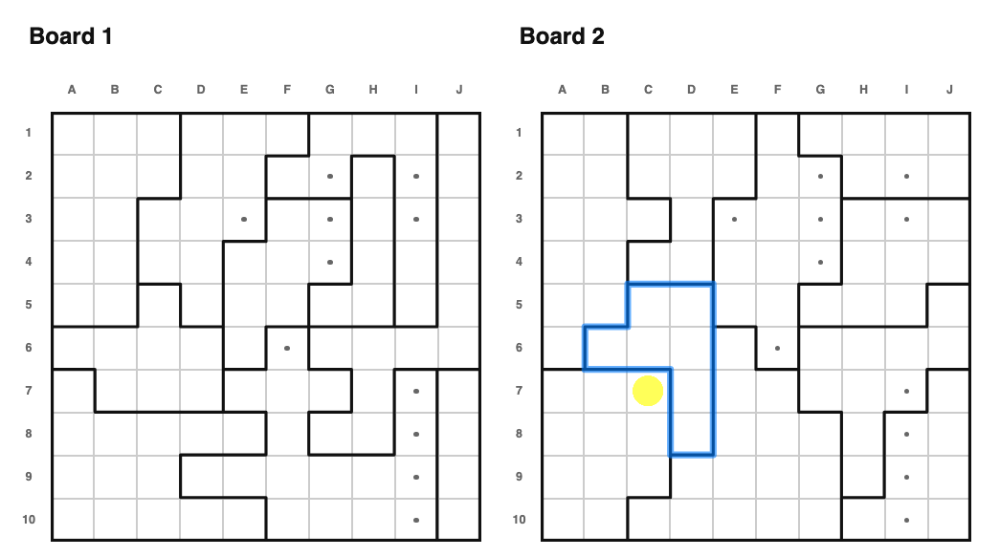</img> </a>

The same reasoning finds dots, too — both inside the unit in question, and in cells
just outside it that every valid completion's stars would touch. Here, the
blue-outlined region on board 2 needs 2 stars and has seven open cells: C5, D5, B6,
C6, D6, D7, and D8. Look at C7, just outside it. The only open cells that *don't*
touch C7 are C5 and D5, and those touch each other, so at most one of them can be a
star. Every valid pair of stars therefore includes at least one of the other cells —
and every one of those touches C7. C7 would touch a star no matter which valid
completion turns out to be real, so it must be a dot.

---

My hint system actually checks this in three passes of increasing thoroughness,
because fully enumerating every valid completion of a large region can get
expensive:

- **Weak**: only rules out completions where two of the unit's own cells touch each
  other. Fast, catches most cases.
- **Intermediate**: also rules out completions that would overload some other
  row/column/region *on the same board*.
- **Strong**: also accounts for regions on *other* boards — the full, most
  expensive check.

<a href="index.html?book=armory2&puzzle=5">
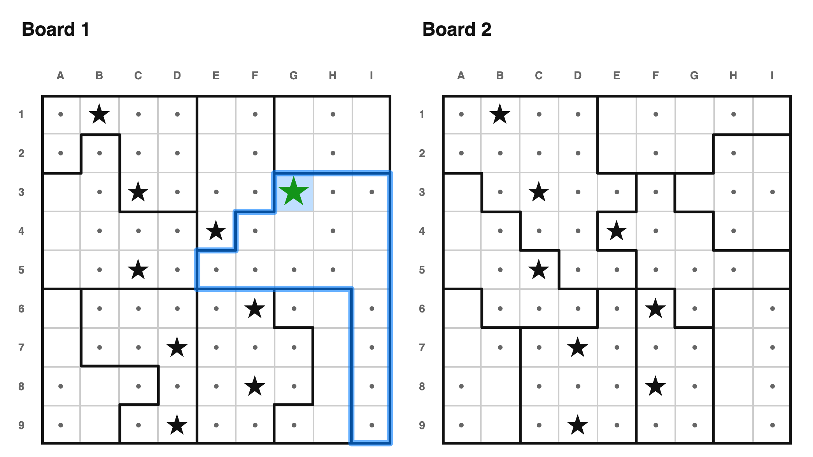</img> </a>

This example specifically needs the "strong" level: G3 only turns out to be forced
once you account for how tightly other rows, columns, and regions *on both boards*
are already boxed in — the "weak" and "intermediate" passes alone can't see it.

## Tiles

Tiles aren't actually new to 2★+ — they're covered in
[the first volume](how_to_solve.md) too — but they get more mileage here, since a
unit needing several stars gives them more room to work with. Take any 2×2 block of
cells. No matter which of its cells are still empty, that block can **never** hold more than one
star — every cell in a 2×2 block touches every other cell, even diagonally.

Now look at a pair of adjacent rows (or columns) that's still missing, say, 3 stars.
If the empty cells in that pair can be cleanly split into exactly 3 non-overlapping
2×2 "tiles", then — since no tile can hold more than 1 star, and we need exactly 3
stars from exactly 3 tiles — pigeonhole tells us **every single tile** must hold
*exactly* one star, not just "at most" one.

<a href="index.html?book=armory2&puzzle=6">
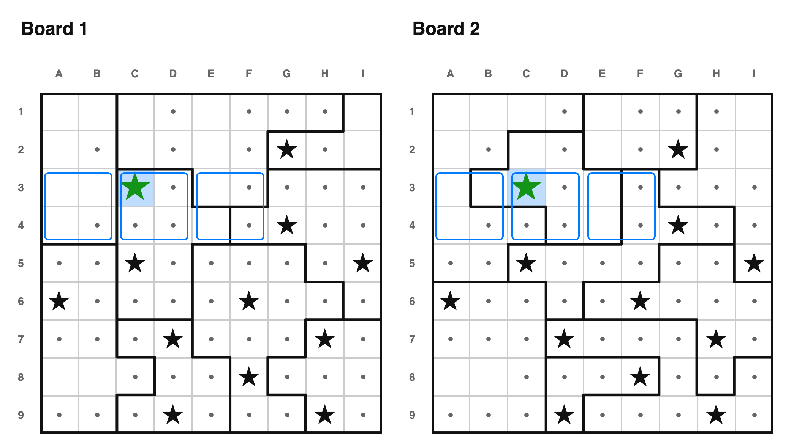</img> </a>

Here, a row-pair still needs 3 stars, and splits cleanly into exactly 3 tiles — one
of which has only a single empty cell left (C3). Since that tile is guaranteed
exactly one star, and it only has room for one candidate, C3 must be the star.

---

<a href="index.html?book=armory2&puzzle=7">
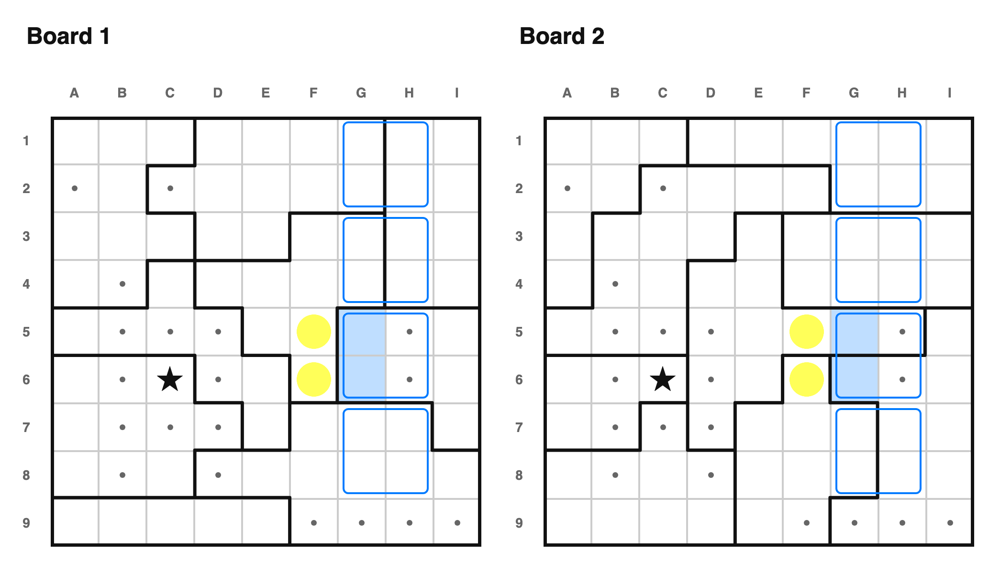</img> </a>

A confirmed tile with exactly two empty cells holds exactly one star, but we don't
know which of the two. Even so, any other cell that touches **both** of them can
still be dotted — whichever of the two ends up with the star, it would touch that
cell either way. That's what rules out F5 here.

---

<a href="index.html?book=armory2&puzzle=8">
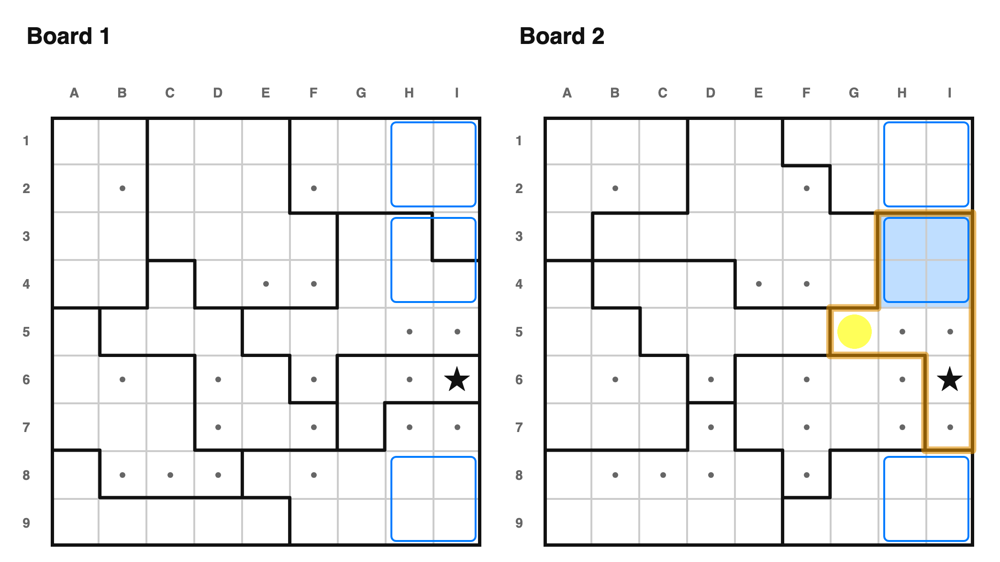</img> </a>

Confirmed tiles don't have to come from the same band to be useful. If a row,
column, or region still needs exactly `K` more stars, and you can find `K`
confirmed tiles that are all disjoint subsets of its remaining empty cells, those
tiles alone account for the unit's entire remaining quota — so every other empty
cell in that unit must be a dot. Here a single confirmed tile already covers a
region's entire remaining need (K=1), so G5 — a cell in that region but outside the
tile — must be a dot.

---

<a href="index.html?book=armory2&puzzle=9">
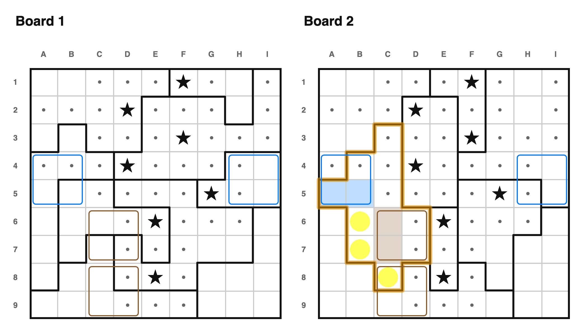</img> </a>

The general K>1 case: the amber-outlined region on board 2 still needs 2 stars,
and among its remaining empty cells — A5, B5, B6, C6, B7, C7, and C8 — sit two
disjoint confirmed tiles, {A5, B5} and {C6, C7}. Together those two tiles already
account for both of the region's remaining stars, so B6, B7, and C8 — inside the
region but outside both tiles — must be dots.

---

<a href="index.html?book=armory2&puzzle=10">
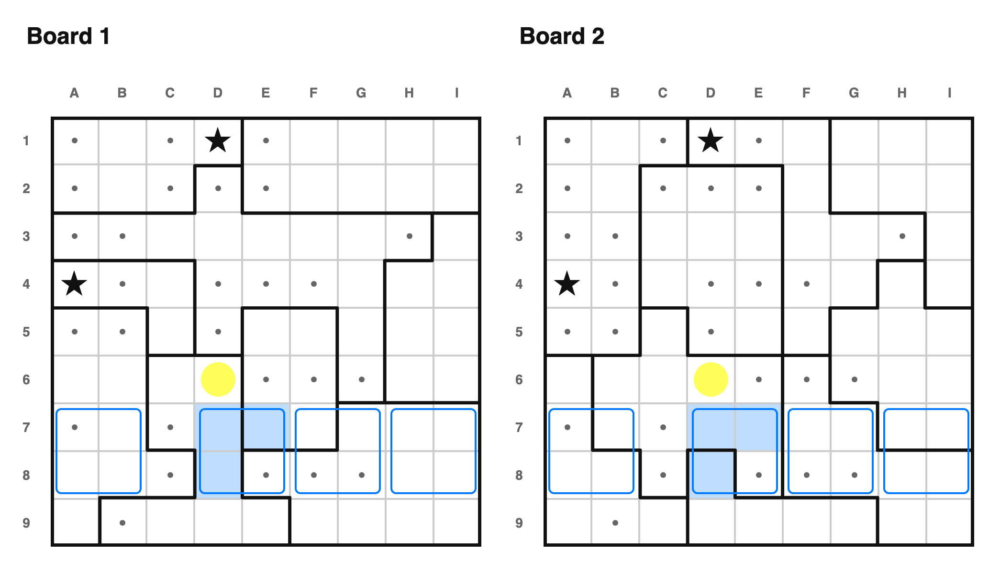</img> </a>

Just like the 1★ "sees too much" technique, if every cell of a confirmed tile
"sees" some other cell — either by touching it directly, or because that
particular placement would complete a row or column and leave no room for anything
else — that other cell must be a dot. That's D6's fate here: no matter which of the
tile's cells ends up holding the star, D6 is ruled out either way.

---

<a href="index.html?book=armory2&puzzle=11">
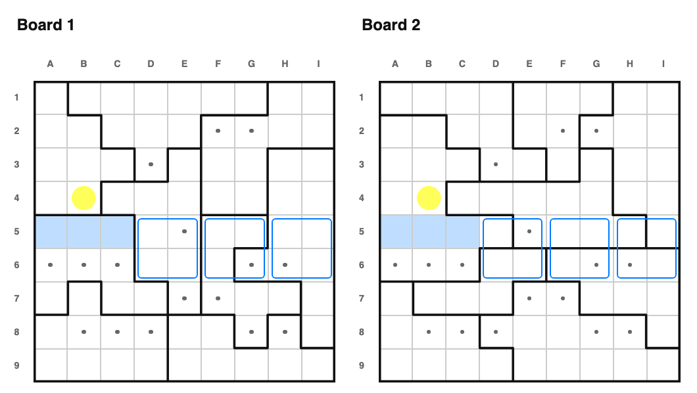</img> </a>

A subtler tiling trick: this row-pair (rows 3 and 4) still needs 4 stars, and
columns D through I tile cleanly into three confirmed tiles — so those six columns
can supply at most 3 of the 4 needed stars. That means the remaining cells of the
pair, A4/B4/C4 (A3, B3, and C3 are already dots — a straight run along row 4), must
supply at least 1 star themselves — a guarantee even though we don't know which of
the three. B5 touches all three of them (A4 and C4 diagonally, B4 directly), so if
B5 were a star, none of A4/B4/C4 could be — leaving that guaranteed star with
nowhere to go. B5 must be a dot.

---

<a href="index.html?book=armory2&puzzle=12">
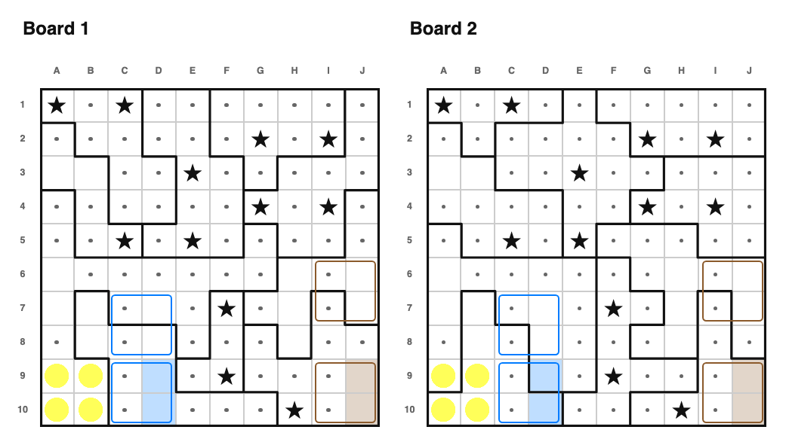</img> </a>

Confirmed tiles from two *unrelated* bands can still add up if they happen to
overlap the same window. Here, a column-pair tile at D9/D10 and another,
unrelated column-pair tile at J9/J10 both land inside the same row-pair (rows 9
and 10) — and that row-pair needs exactly 2 stars. Independently, each tile is
guaranteed one star; together, that's the row-pair's entire remaining quota. So
every other empty cell in rows 9 and 10 — A9, A10, B9, and B10 — must be dots.

## Region tiles

Tiles can come from regions too, not just from pairs of rows or columns. Suppose a
region still needs K stars, and its remaining empty cells can be split into exactly
K groups where every group fits inside a 2×2 block. Each group can hold at most one
star, and the region needs K stars from K groups, so **every group holds exactly one
star**. That's the same pigeonhole argument as above, applied to a single region.

Two things follow from one such group (a "tile") alone. If it has only one empty
cell left, that cell is the star. If it has two or three, any other cell that
touches *all* of them touches the group's star no matter which one it is, so it must
be a dot. These are the same deductions Unit Placement Forced finds for a region
(and they're scored at the same level, Beginner), but showing the tiles makes them
much easier to see, which is why the hint system tries them first.

<a href="index.html?book=armory2&puzzle=24">
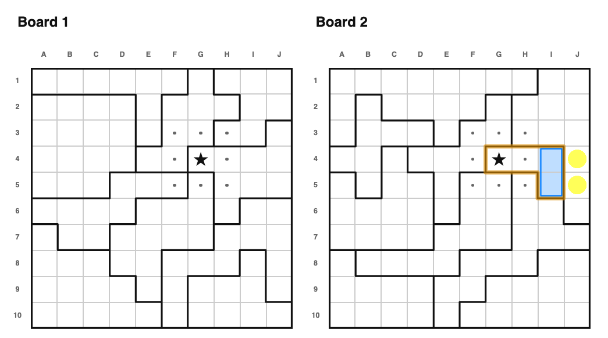</img> </a>

Board 2's amber-outlined region already has one star (G4) and needs one more. Its
only empty cells left are I4 and I5, which touch each other, so they form a single
tile that holds the last star. J4 and J5 each touch both I4 and I5, so whichever one
turns out to be the star, J4 and J5 are next to it: both are dots.

---

<a href="index.html?book=armory2&puzzle=25">
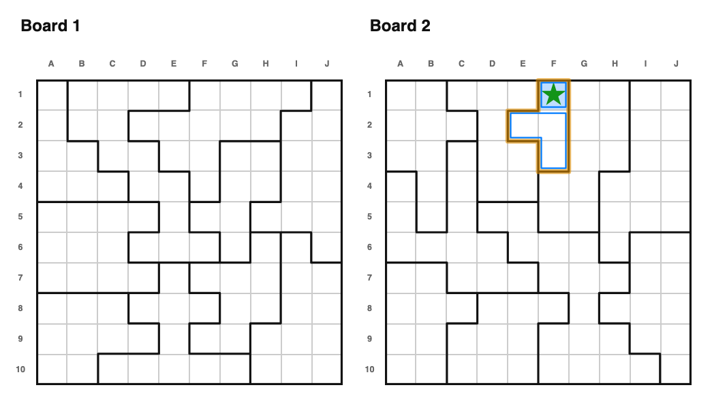</img> </a>

Here the amber-outlined region on board 2 needs 2 stars and has three empty cells
left: C1, D1, and D4. C1 and D1 touch, so they make one tile that can hold only one
star, and D4 is a tile of its own. Two stars from two tiles means each tile holds
exactly one — so D4 is a star.

---

<a href="index.html?book=armory2&puzzle=26">
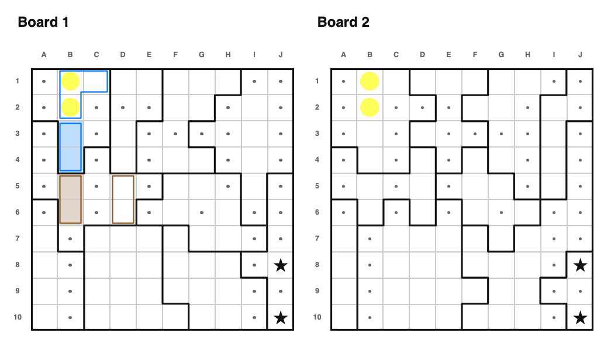</img> </a>

Region tiles also fill rows and columns, and this one is easy to spot when every
tile sits inside a single row or column. Column D still needs 2 stars. The
highlighted tiles D3–D4 and D5–D6 each belong to a region that is split into tiles
exactly as above (blue and brown), so each holds exactly one star. Together they
account for both of column D's stars, so every other empty cell in the column —
D1 and D7 through D10 — is a dot.

## Adjacent and disjoint rows/cols, revisited

The 1★ "adjacent rows/cols" and "disjoint rows/cols" techniques generalize
directly, with one wrinkle: instead of comparing a *count* of regions to a *count*
of rows/columns, you have to compare their *summed remaining star need*, since a
region or a row can need more than one star now.

<a href="index.html?book=armory2&puzzle=13">
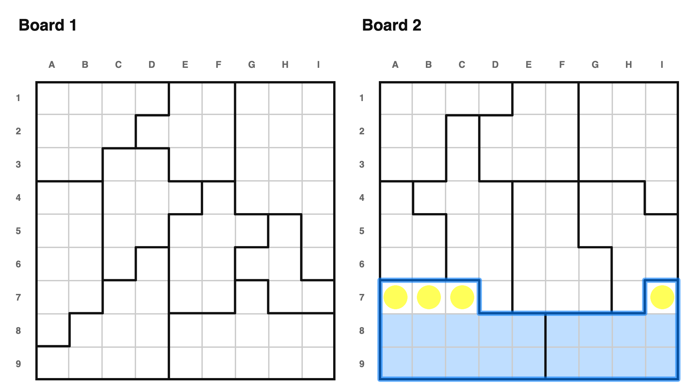</img> </a>

Here, rows 8 and 9 (highlighted) still need 4 stars between them, and every one
of their empty cells sits in one of the outlined regions — which need exactly 4
stars themselves. So rows 8 and 9 must be supplying those regions' entire remaining
quota, and the rest of those regions' cells (A7, B7, C7, and I7) must be dots.

---

<a href="index.html?book=armory2&puzzle=14">
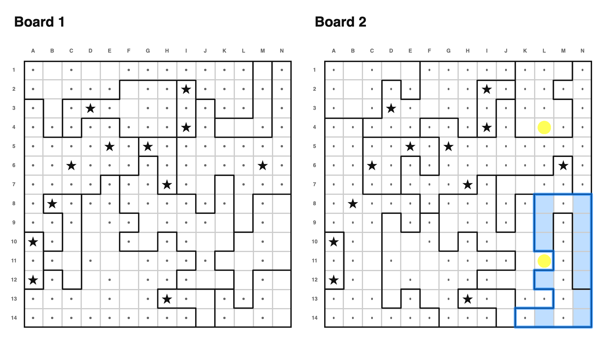</img> </a>

Same idea, but the two columns don't have to be next to each other. Columns L and
N are both still starless, needing 4 stars between them — and two regions on
board 2, confined entirely to those two columns, need exactly 2 stars each. Their
combined need already covers the columns' entire quota, so the rest of columns L
and N — here, L4 and L11 — must be dots.

## Region/Line Quota Fill

This is the other big new idea in 2★+ puzzles, and it builds directly on Unit
Placement Forced above. Sometimes a region's remaining stars aren't fully confined
to one row or column, but every one of its valid completions still puts *at least*
some number of stars in a particular row or column anyway. That's a "guarantee" —
something you can bank on regardless of which completion is real.

<a href="index.html?book=armory2&puzzle=15">
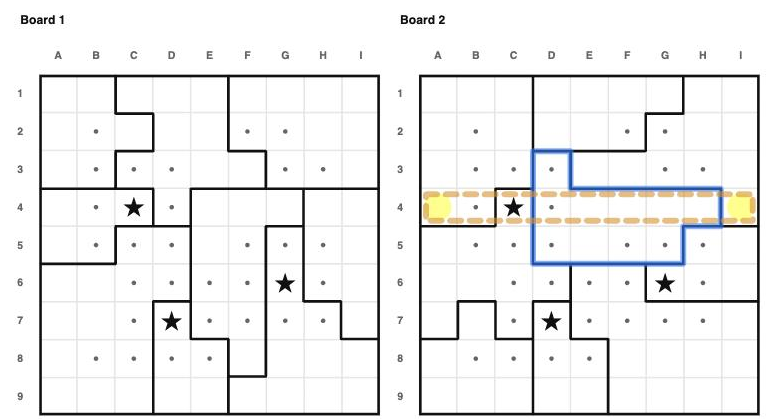</img> </a>

The amber-outlined row here needs exactly 1 more star. The blue-outlined region
is guaranteed to place at least 1 star in that row no matter how its own
remaining cells resolve — and since that alone already covers the row's whole
remaining need, every other empty cell in the row (A4 and I4) must be a dot.
(With more than one region involved, you'd add up several regions' guarantees to
hit the line's quota — this example just happens to need only one.)

---

<a href="index.html?book=armory2&puzzle=16">
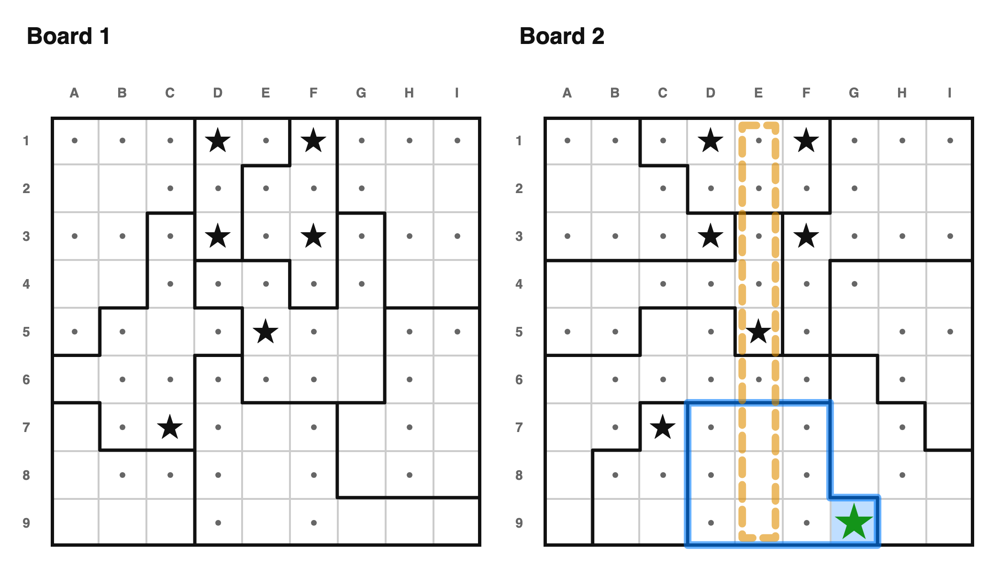</img> </a>

Two siblings of this idea are worth a mention. Once a region's contribution to a
line is pinned to an exact count (like the column above), you can treat its
remaining cells — split into "in the line" and "everywhere else" — as their own
small, self-contained puzzles. Here, the blue-outlined region must place exactly 1
star in the amber column, which pins its *other* remaining star to the rest of the
region; every valid way to place that one star happens to agree on G9, so G9 must
be a star ("partition forced"). The other sibling ("partition trapped") runs the
same idea in reverse: if a region is proven to place at least a few stars among a
fixed set of its own cells, any outside cell touching *all* of them can be dotted,
without needing to know exactly which cell gets the star.

---

<a href="index.html?book=armory2&puzzle=22">
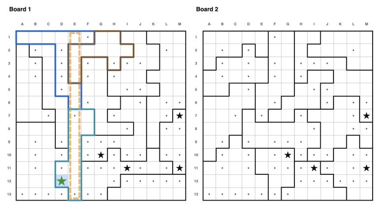</img> </a>

"Partition forced" sums guarantees across several regions the same way quota fill
does — the single-region case above just happens to be the easy version. Here, the
amber-outlined column needs 3 more stars, and three different regions (blue, brown,
cyan) are each independently guaranteed at least 1 star in it, no matter how their
own cells resolve. Those three guarantees already add up to exactly the column's
whole remaining need, so none of the three can contribute *more* than its own
guaranteed share without overshooting — which pins the cyan region's share to
exactly 1, and its other 2 stars to the rest of its own cells. Every valid way to
place those 2 stars happens to agree on D12, so D12 must be a star. The blue and
brown regions get outlined too, even though neither one's own marked cell is shown
here — their guarantees are just as load-bearing to the "exactly 1" claim as
cyan's own shape is, so hiding them would leave the "no matter how" half of the
argument floating with nothing to point at.

---

<a href="index.html?book=armory2&puzzle=23">
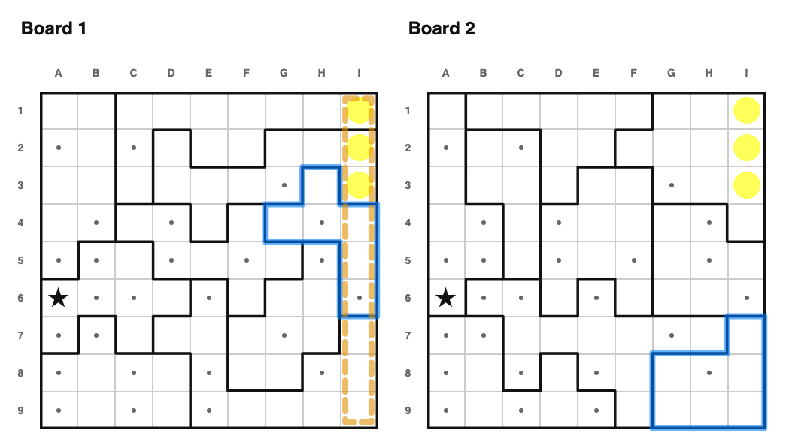</img> </a>

Quota fill doesn't have to stay on one board, either. Here, the amber-outlined
column I needs 2 more stars, and neither blue-outlined region is guaranteed that
many in it on its own. The blue region on board 1 needs 2 stars, and its open cells
outside column I — H3 and G4 — touch each other diagonally, so at most one of them
can be a star: at least one of the region's stars has to land in column I (I4 or I5).
The same goes for the blue region on board 2: its open cells outside column I (G8,
G9, and H9) all touch each other, so at least one of its 2 stars has to land in I7,
I8, or I9. The two regions' share of column I doesn't overlap, and both boards share
the same underlying cells, so between them they guarantee 2 stars in column I — its
entire remaining need. I1, I2, and I3 must be dots, a conclusion neither board could
reach on its own.

## Symmetry, revisited

The symmetry techniques from the first volume still apply, with one adjustment.
For 1★ puzzles, if a cell and its mirror image shared any row/column/region, that
was always a contradiction — a 1★ unit only ever holds one star, period. For 2★+,
sharing a unit is only a problem if that unit has **one or fewer** stars left to
place; if it still needs two or more, both the cell and its mirror can happily be
stars in it at once.

I don't have a good small example of this one yet — a genuinely symmetric pair of
boards is already a rare coincidence to generate on purpose, and I haven't found
one small enough to be worth screenshotting for this document. If you run across a
2★+ puzzle in the wild that needs this, let me know.

## Unit completion satisfies other unit

Another technique with no 1★ analogue. Enumerate every valid way to place a unit's
remaining stars, same as above — but this time, check whether **every single one**
of those completions happens to exactly fill up the entire remaining quota of some
*other* row, column, or region too. If so, that other unit's quota is guaranteed to
come entirely from this unit, no matter which completion is real — so any of that
other unit's cells that lie *outside* this one must be dots. I don't have a compact
example of this one yet either; it turned out to be one of the rarer techniques
in my test puzzles.

## Crossboard, revisited

<a href="index.html?book=armory2&puzzle=17">
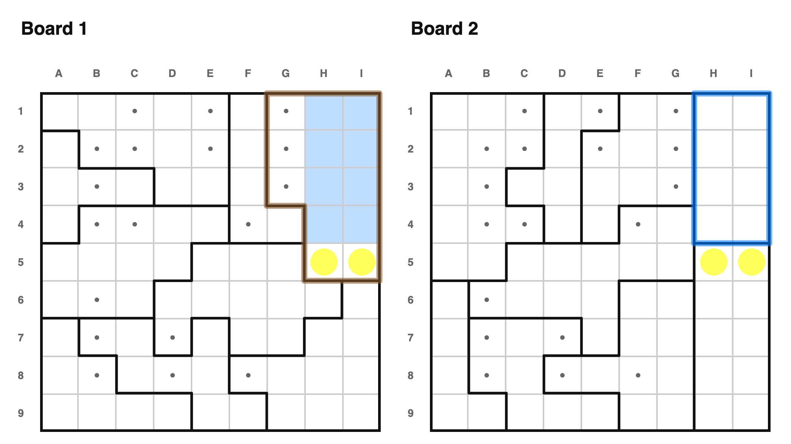</img> </a>

"Region contains region" generalizes the same way adjacent-rows did: instead of
comparing region *counts*, compare their summed remaining need. Here, a region on
board 2 needs exactly as many stars as a region on board 1, and every one of its
open cells is also open in board 1's region — so the extra cells in board 1's
region (H5 and I5) must be dots.

---

<a href="index.html?book=armory2&puzzle=27">
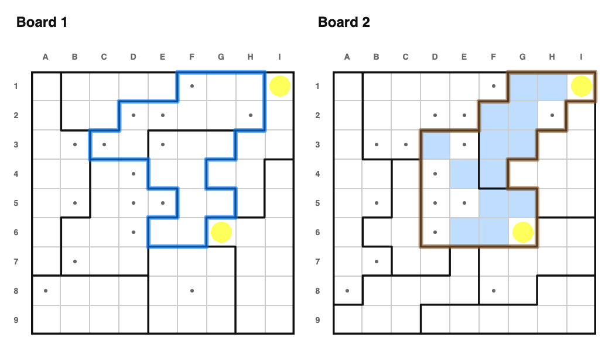</img> </a>

The harder version compares *groups* of up to two regions on the same board. On
board 1, the two regions outlined in blue together need some number of stars; on
board 2, the two regions outlined in brown need exactly the same number, and every
open cell of the blue pair is also an open cell of the brown pair. The blue cells
therefore have to supply all of the brown pair's stars, so the brown pair's other
open cells — I1 and G6 — must be dots.

---

<a href="index.html?book=armory2&puzzle=18">
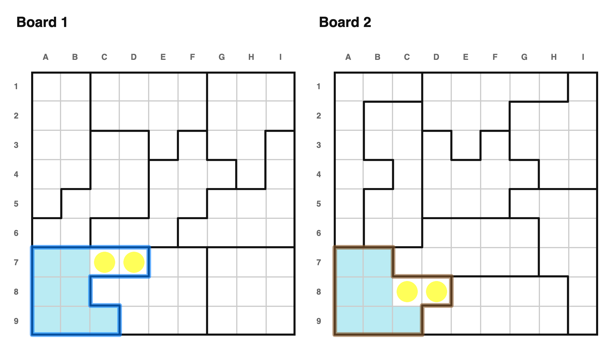</img> </a>

Crossboard partial-overlap generalizes the same way (adjacency instead of "sees",
summed need instead of a raw count): a region on board 1 is adjacent to a region
on board 2, and their combined remaining need already accounts for the touching
cells' whole neighborhood — so C7, D7, C8, and D8 must all be dots.

Crossboard region-pinning generalizes the same way too (summed need instead of raw
counts) — I just don't have a small, clean example of that one handy for this
document yet.

## Partial subsets

<a href="index.html?book=armory2&puzzle=28">
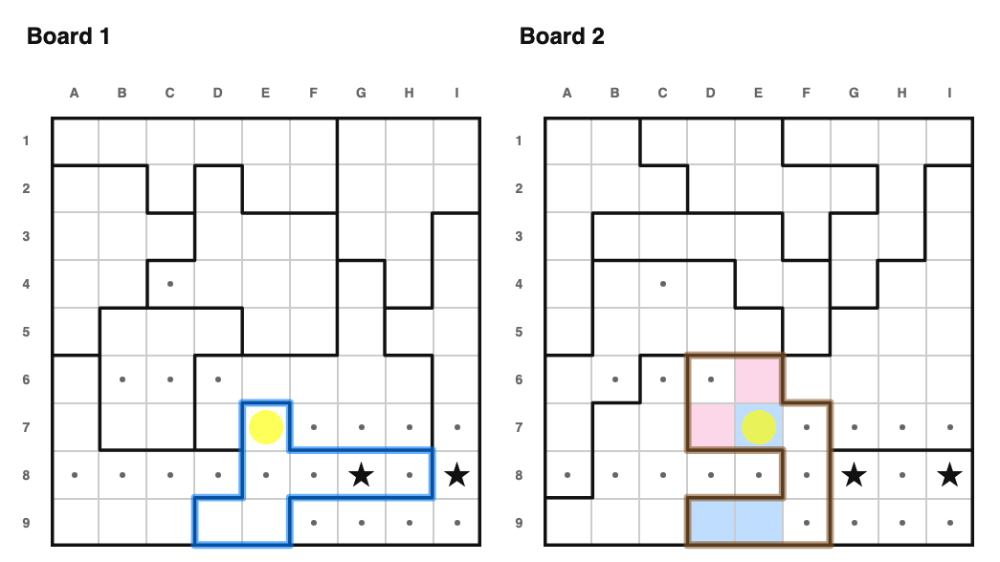</img> </a>

"Region contains region" only works when both sides need the *same* number of
stars, so everything left over is a dot. Drop that requirement and you get a
sneakier version: if every open cell of one unit (the blue region here) is also an
open cell of a bigger unit (the brown region), and the blue one needs *fewer* stars,
then all of the blue stars are among the brown stars — and the brown unit's other
cells must hold exactly the difference. That leftover (the pink cells) is a
brand-new little region with a known star count, and you can reason about it
exactly like any other region.

Here the blue region on board 1 needs 1 more star and the brown region on board 2
needs 2, and all three open blue cells (E7, D9, E9) are open in the brown region
too. So the brown region's remaining cells, E6 and D7, hold exactly 1 star. There
are only two ways to do that, and E7 touches both E6 and D7 — so E7 must be a dot.

The units don't have to be regions: a row or column works the same way, and so
does any mix of the three, from either board. This puzzle is Hard *only* because
of this rule: take it away and my scorer has to reach for an Expert technique
instead. (It's rarely the only way in — most of the time something else in the
Hard tier gets to the same cell first — but it's a real, distinct thing to notice.)

---

<a href="index.html?book=armory2&puzzle=29">
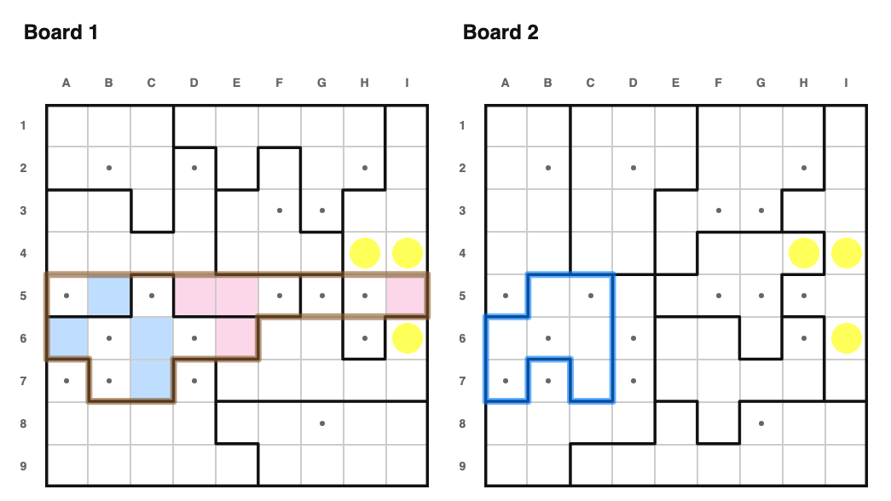</img> </a>

The harder version lets either side be a *union of two units*, adding their needs
together. Two regions are only ever combined on the same board; a row or column
can be paired with anything.

On board 2, the blue region needs 2 stars and has four open cells. On board 1,
the brown outline is row 5 plus a region, which together need 4 stars — and all
four of the blue cells are open inside that union. So the blue region accounts for
2 of those 4, leaving exactly 2 stars for the pink cells (D5, E5, I5, E6). Only
three ways to place 2 non-touching stars there exist, and every one of them uses
I5 — so I5 is a star, and the marked cells H4, I4 and I6 around it must be dots.

---

<a href="index.html?book=armory2&puzzle=30">
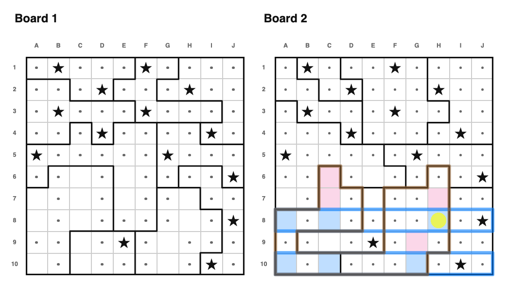</img> </a>

Both sides can be unions at once. The two blue rows (8 and 10) still need 2 stars
between them, and every one of their open cells lies inside the two brown regions
on board 2, which together need 4. That leaves exactly 2 stars for the pink cells
(C6, C7, H7, G9). Of the five ways to place them, every one has a star at H7 or G9
— and both of those touch H8, so H8 must be a dot.

## Region pairs

<a href="index.html?book=armory2&puzzle=19">
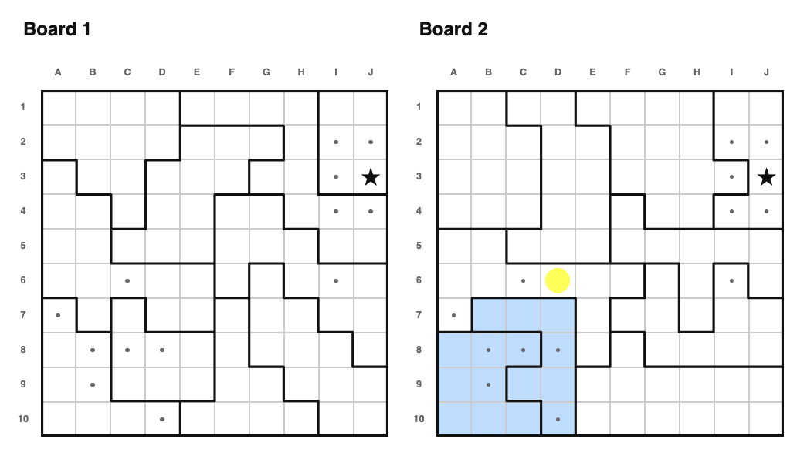</img> </a>

The first volume's region-pair trick generalizes the same way adjacent-rows and
crossboard did: instead of a single combined star count, enumerate every way to
place the *combined remaining need* of two touching regions across their union.
Here, two touching regions on board 2 jointly need 4 more stars among 10 open
cells; every one of the 15 valid placements puts a star at C7 or D7, both of
which touch D6 — so D6 must be a dot.

---

<a href="index.html?book=armory2&puzzle=20">
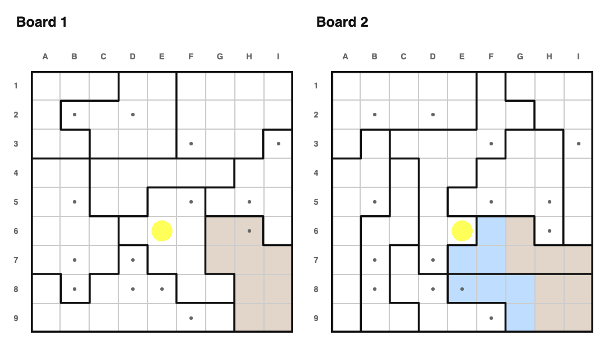</img> </a>

Region algebra generalizes the same way: two regions jointly hold 4 stars, and
another region — this time on a *different* board, the crossboard case — has
all of its open cells inside them and needs 2 stars of its own. That leaves
exactly 2 stars for the rest of the pair. Every one of the 6 ways to place
those 2 remaining stars puts one next to the circled cell, so it must be a dot.

## Lookahead

<a href="index.html?book=armory2&puzzle=21">
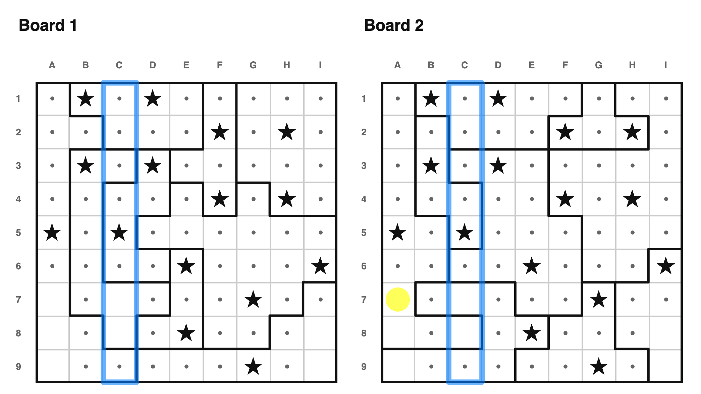</img> </a>

Same idea as the first volume's half-stage lookahead: hypothesize a star at some
cell, propagate the immediate consequences (adjacency, filled units, only-empty),
and see if it breaks the board. Here, a star at the circled cell would leave the
blue-outlined column unable to reach its required star count — so the circled cell must
be a dot.

I also have a multi-stage version of this — repeating the propagation for several
rounds instead of just one — generalizing the first volume's "technique of last
resort." It's implemented, but disabled in the live scorer for performance (a full
board-wide speculative sweep, repeated per stage, gets slow fast at 3★+ scale), so
it can never actually be the hardest rule a real generated puzzle needs. No example
here, for the same reason: it doesn't even get the chance to run.

---

I suspect there are more human-viable 2★+ rules I haven't found yet, and I'd like
to fill in the handful of techniques above that don't have examples yet once I find
(or generate) clean small puzzles for them. If you think of one — or spot a good
candidate puzzle — let me know, same as the original document.
