# How to Solve, 2★+ Regionless

This is a companion to [how_to_solve2.md](how_to_solve2.md), for regionless boards
that need more than one star per row/column — see
[how_to_solve_regionless.md](how_to_solve_regionless.md) for the 1★ case first. I'm
not re-deriving each technique here, just showing which of part 2's ideas still work
once regions are gone, and what they look like without them.

All of the example puzzles below live in the `armory2_regionless` book, and (since
every regionless puzzle I publish is single-board) each one is a single board rather
than a pair. Click any image to load that exact puzzle.

## The rules of the puzzle, revisited

Neither half of this needed regions to begin with — "exactly enough empty cells
left" and "stars can't touch" both work identically on a row or column.

<a href="index.html?book=armory2_regionless&puzzle=1">
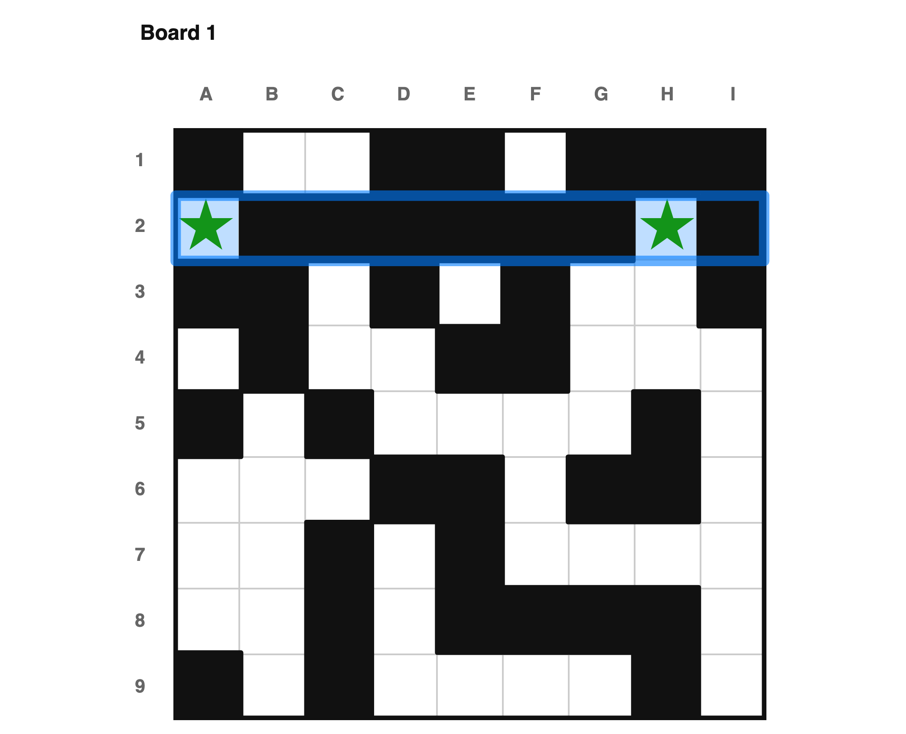</img> </a>

Row 2 has exactly two non-void cells, A2 and H2, and this board needs 2 stars per
row — so both must be stars.

---

<a href="index.html?book=armory2_regionless&puzzle=2">
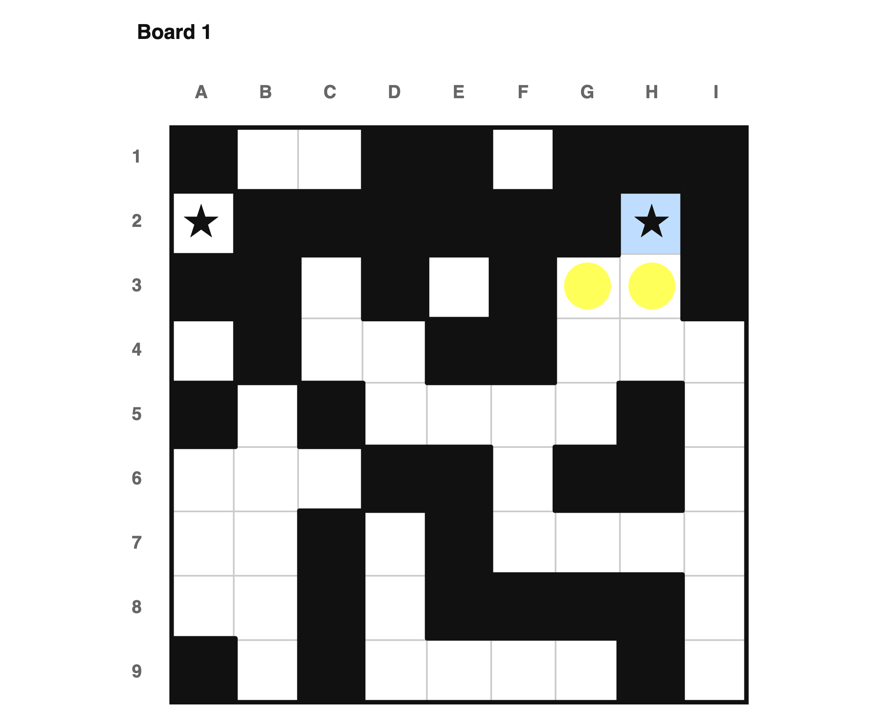</img> </a>

H2 is already a star, so G3 and H3 — both touching it — become dots.

## Unit Placement Forced

This one never mentioned regions in its own description — "take a row, column, or
region" — and it doesn't need one either: the combinatorial argument works the same
way over a row or column's own remaining empty cells.

<a href="index.html?book=armory2_regionless&puzzle=3">
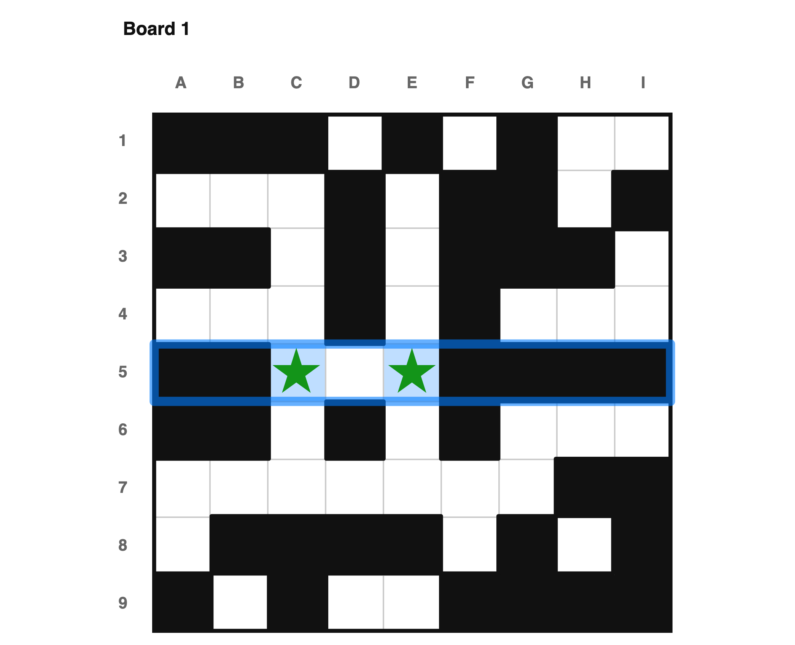</img> </a>

This row's three remaining empty cells, C5/D5/E5, need 2 non-touching stars. Since
D5 touches both of its neighbors, the only way to fit 2 stars is to skip it — so C5
and E5 must both be stars.

## Tiles

Tiles apply just as fully at 2★+ as they did in the 1★ companion — every variant
I checked (domino-style, two-empty-dot, quota-fill, sees-too-much, pair-quota-fill,
disjoint-quota-fill, and bar-trapped) fired on regionless boards in testing. The only
absent one is, unsurprisingly, "tile falls inside a real drawn region."

<a href="index.html?book=armory2_regionless&puzzle=4">
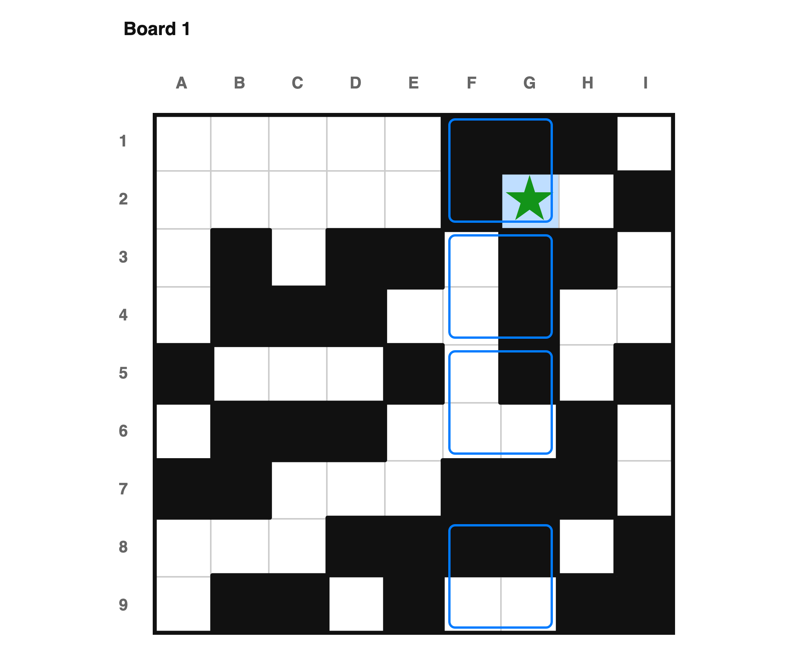</img> </a>

This column-pair still needs 4 stars, and splits cleanly into 4 confirmed tiles —
one of which has only a single empty cell left, G2. Since that tile is guaranteed
exactly one star, G2 must be it.

---

<a href="index.html?book=armory2_regionless&puzzle=5">
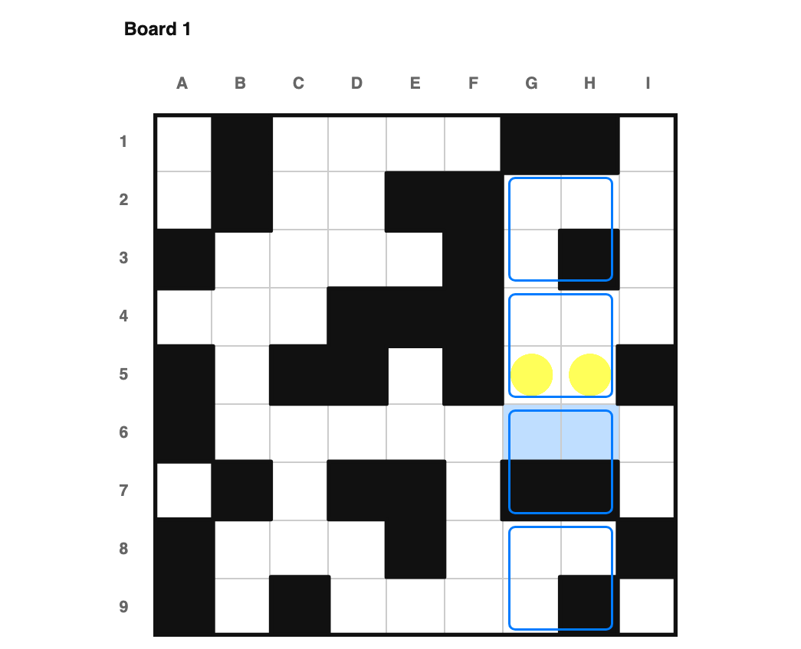</img> </a>

A confirmed tile with exactly two empty cells (G5, H5 here) is guaranteed exactly
one star — but voids or not, this rule never needs to know *which* one. Any other
cell touching both G5 and H5 would be dotted whichever cell wins, and here that's
already every one of this puzzle's very first round: no prior deduction was even
needed to spot it.

---

<a href="index.html?book=armory2_regionless&puzzle=6">
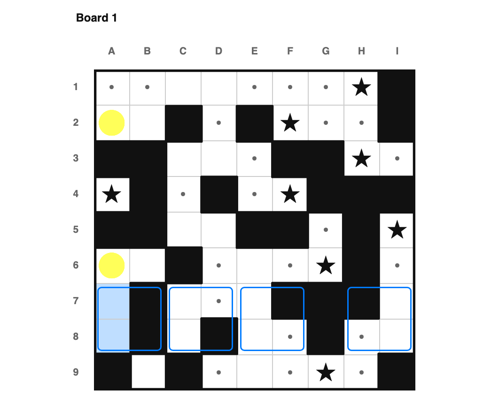</img> </a>

Column A still needs exactly 1 star, and its remaining empty cells — A2, A6, A7,
and A8 — include a confirmed tile, {A7, A8}, that's guaranteed exactly one star
all by itself. That already covers the column's whole remaining need, so A2 and
A6 — inside the column but outside the tile — must be dots.

---

<a href="index.html?book=armory2_regionless&puzzle=7">
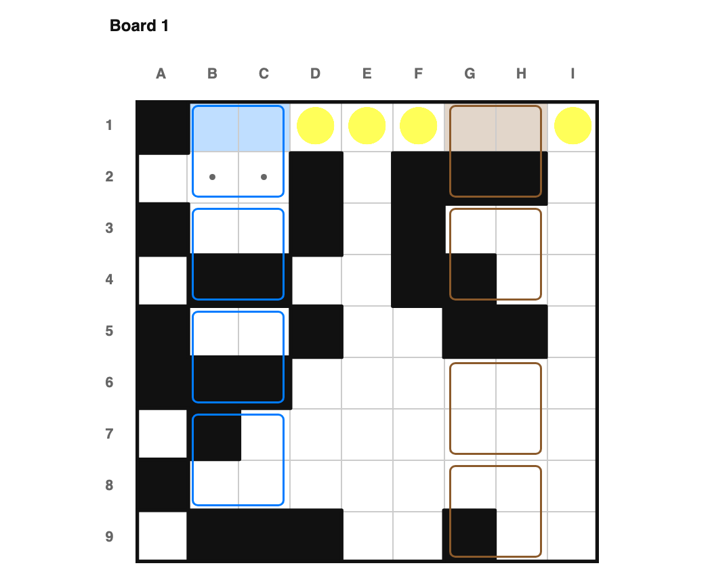</img> </a>

Row 1 still needs 2 stars, and its remaining empty cells split into two disjoint
confirmed tiles, {C1, D1} and {G1, H1} — together already accounting for the
row's entire quota. So every other empty cell in row 1 — B1, E1, F1, and I1 —
must be dots.

---

<a href="index.html?book=armory2_regionless&puzzle=8">
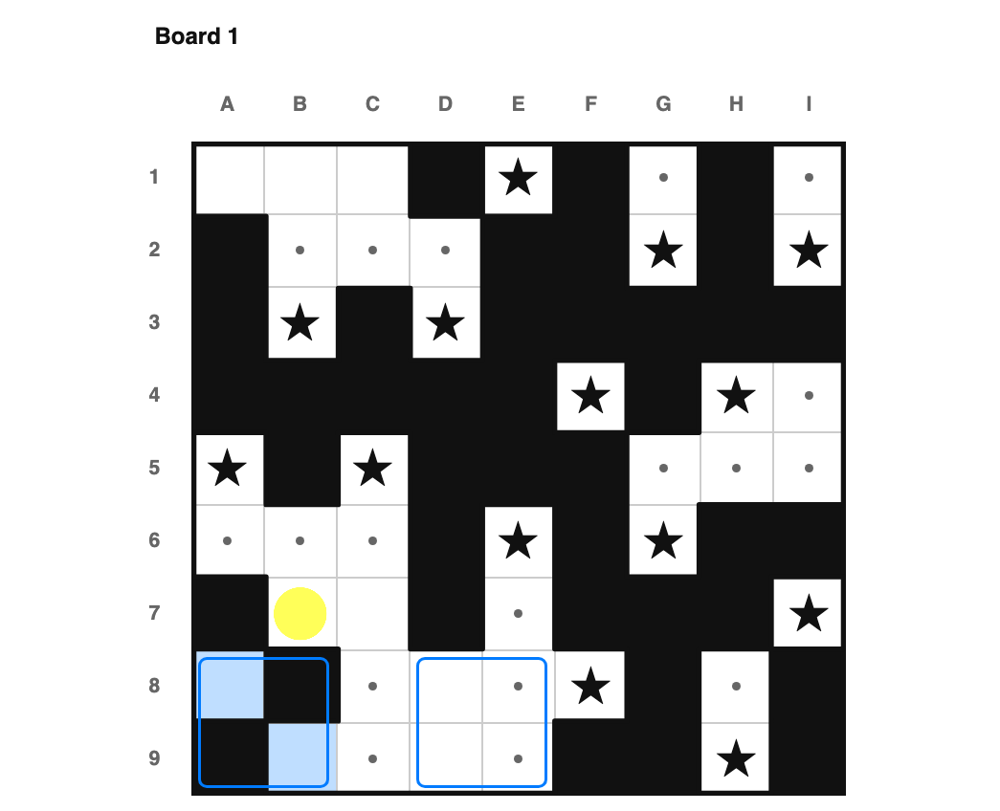</img> </a>

A confirmed tile doesn't need three cells to trigger this — two cells that are
diagonally opposite each other work too, since whichever one holds the star, an
outside cell touching both is still ruled out. Here A8 and B9 form such a tile,
and B7 touches both of them, so B7 must be a dot.

---

<a href="index.html?book=armory2_regionless&puzzle=9">
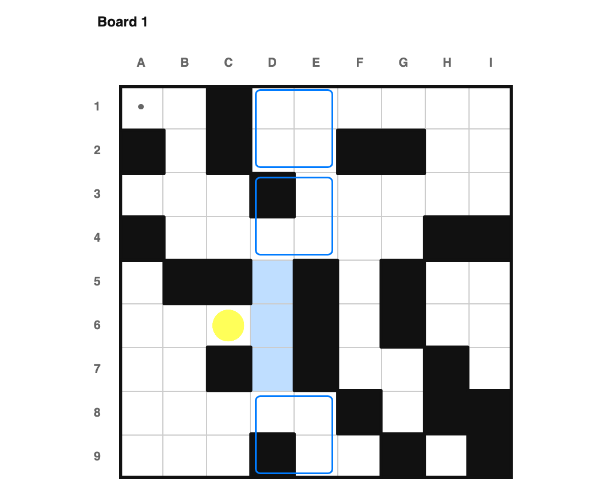</img> </a>

Bar-trapped works the same way voids or not — voids just tend to shrink the tiles
involved. This column-pair (D and E) also needs 4 stars. Columns D/E split into
three confirmed tiles, so those tiles can supply at most 3 of the 4 needed stars —
meaning the three cells left over, D5/D6/D7 (a void in column E leaves this stretch
only one cell wide), must supply at least 1 star between them. C6 touches all three
of them, so if C6 were a star, none of D5/D6/D7 could be — leaving that guaranteed
star nowhere to go. C6 must be a dot.

---

<a href="index.html?book=armory2_regionless&puzzle=10">
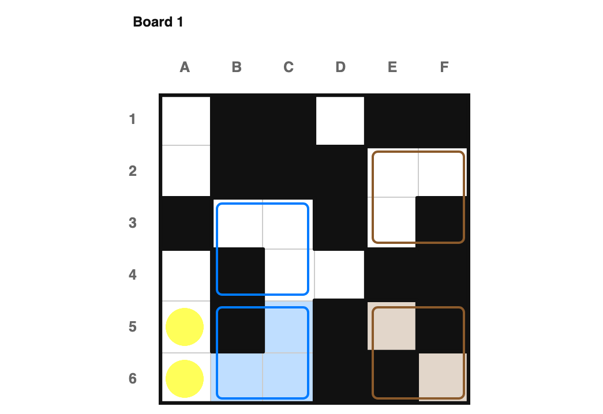</img> </a>

Two confirmed tiles from unrelated column-pairs — C4/C5 and E4/E5 — both happen
to land inside the same row-pair, rows 4 and 5. That row-pair needs exactly 2
stars, and these two independent tiles already guarantee one each — so every
other empty cell in rows 4 and 5, including G5, must be a dot.

## Adjacent and disjoint rows/cols, revisited

Same as in part 1: both of these compare a *count of regions* to a *count of
rows/columns*, so neither has a regionless equivalent. Row/col line sync is the
regionless-native substitute — see below.

## Region/Line Quota Fill

This technique is defined entirely in terms of a region's contribution to a line —
there's no regionless equivalent.

## Symmetry, revisited

180-degree rotation carries over unchanged, checking the void mask's symmetry
instead of region-layout symmetry. Diagonal symmetry and diagonal parity, on the
other hand, didn't turn up at all in my regionless testing — not even in puzzle
pools specifically generated to be diagonally symmetric — so I'm not confident they
meaningfully apply at 2★+; I've left them out rather than force an example.

<a href="index.html?book=armory2_regionless&puzzle=11">
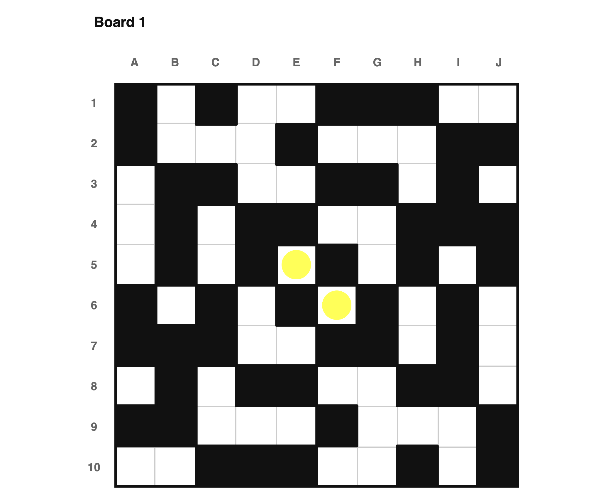</img> </a>

This board has 180-degree symmetry. E5 and F6 are each other's rotation and touch,
so neither can be a star — both must be dots.

## Unit completion satisfies other unit

I couldn't find this one firing on any regionless board I tested. It may still be
theoretically possible — its own description allows a row's completions to force a
column's quota, no region required — but it seems to be too rare to matter in
practice.

## Crossboard, revisited

Every crossboard technique compares regions across two different boards. None of
them have a regionless equivalent, and every regionless puzzle I publish is
single-board besides.

## Row/col line sync, revisited

Rows against columns, no regions involved — so it works on a regionless board
exactly as it does on a regular one. At 2★+ the rows and the columns they touch
don't have to match in count: what has to match is the rows' remaining star need
and those columns' remaining room.

<a href="index.html?book=armory2_regionless&puzzle=12">
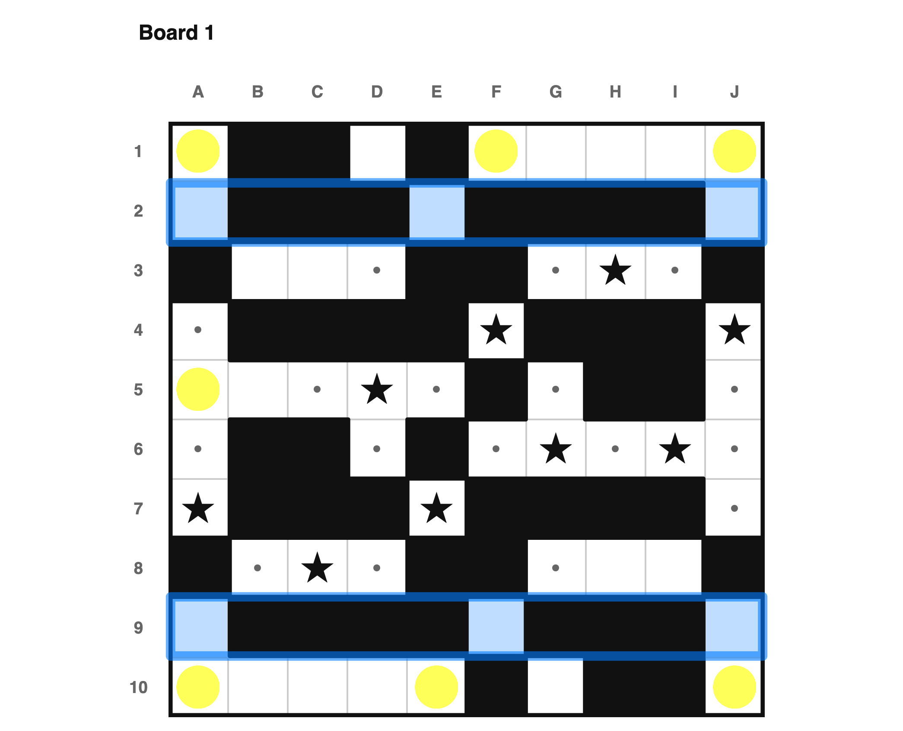</img> </a>

Rows 2 and 9 have no stars yet, so they need 4 between them. Their only non-void
cells are A2, E2, J2, A9, F9, and J9 — all in columns A, E, F, and J — and each of
those columns already has one star, leaving exactly 4 stars of room between them.
So all of those columns' remaining stars land in rows 2 and 9, and every other
empty cell in them — A1, F1, J1, A5, A10, E10, and J10 — must be a dot.

As in the regions version (see [how_to_solve2.md](how_to_solve2.md)), this is the
last Expert technique the scorer tries at 2★+, and puzzles almost never *need* it
— this example is a position where it applies, not one that requires it.

## Lookahead

Unlike the 1★ case (where multi-stage lookahead survives just fine), I didn't find
*any* lookahead rule firing on a 2★+ regionless board in testing, half-stage or
multi-stage. I suspect the extra room 2★+ regionless boards have — more stars means
more give in the "no empty cells left" bookkeeping lookahead depends on — makes
these contradictions harder to construct. No example here for that reason.

---

That covers every 2★+ technique from the original document, regionless or not.
