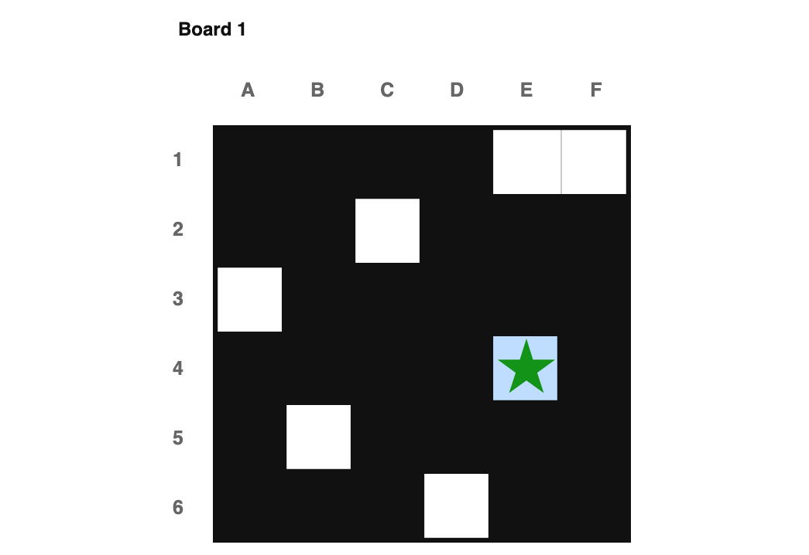
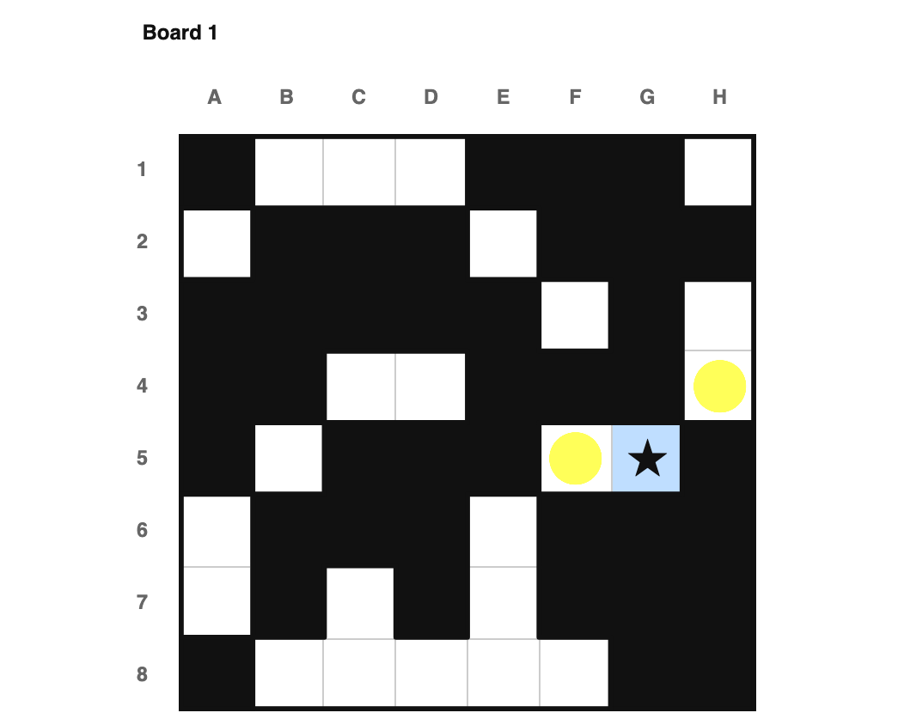
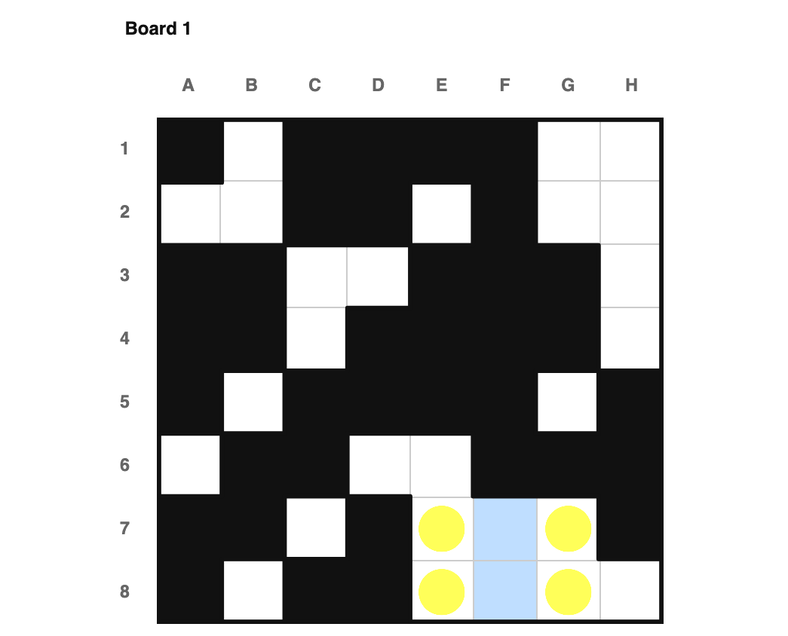
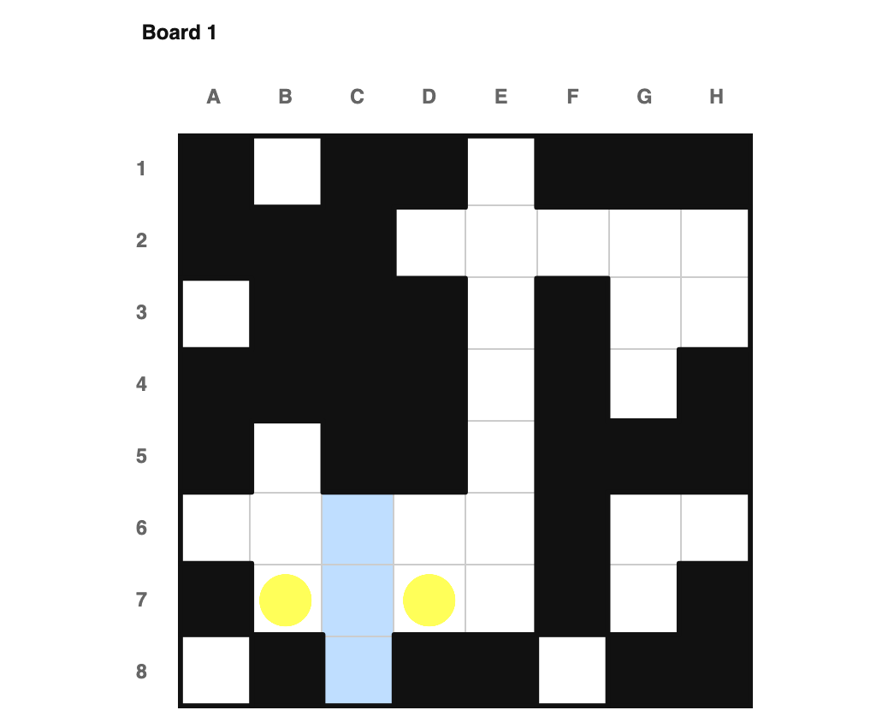
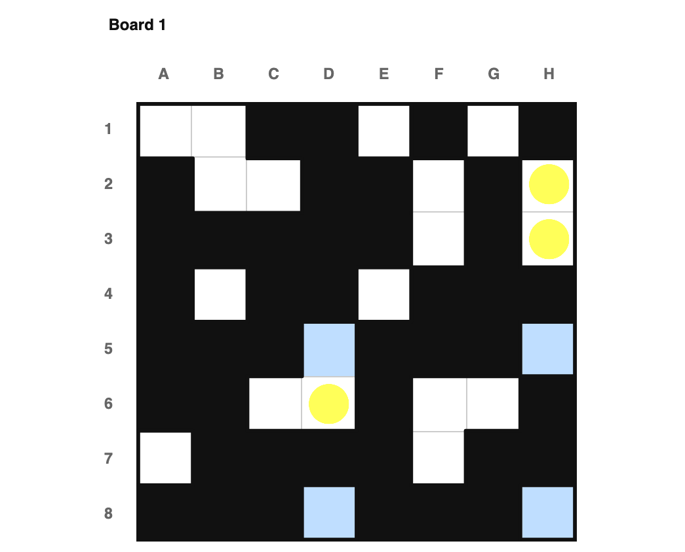
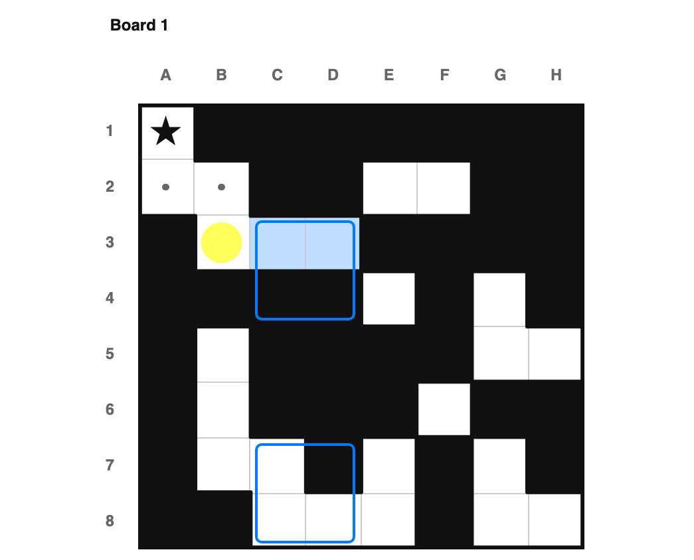
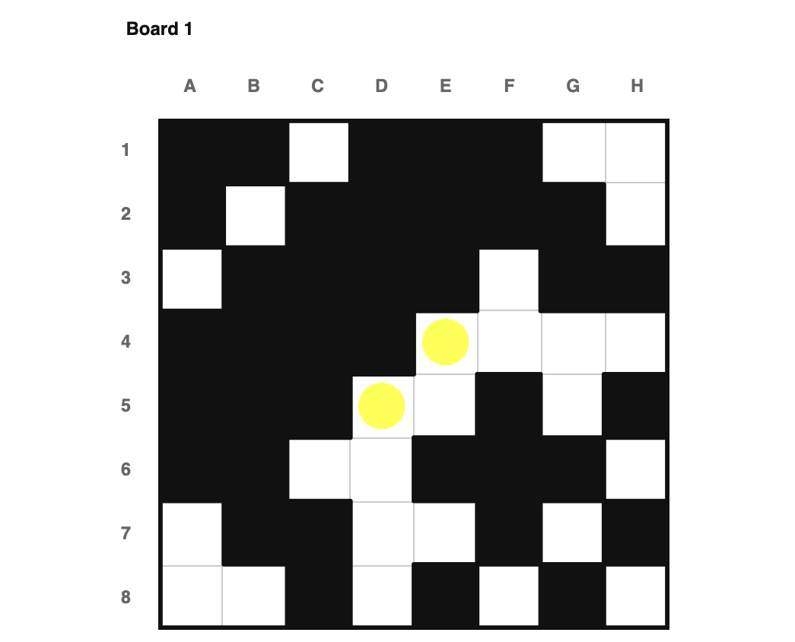
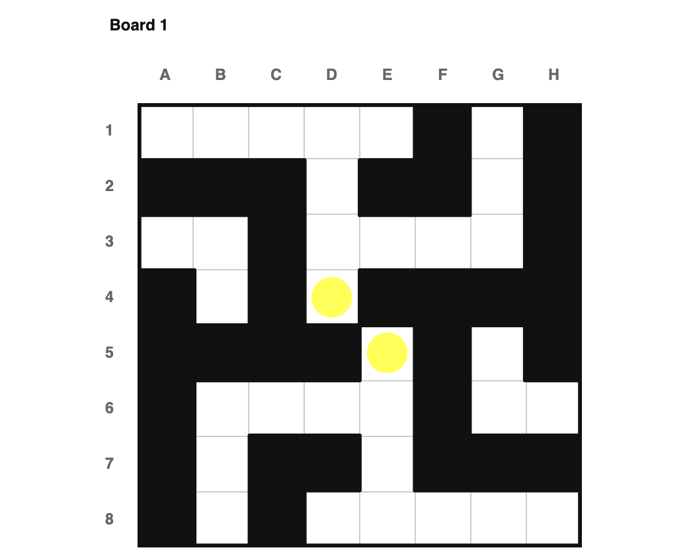
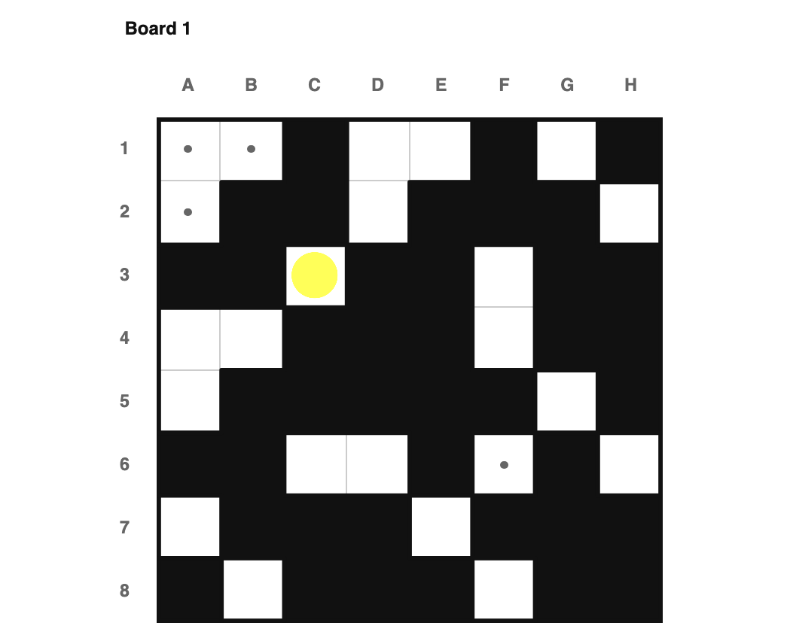
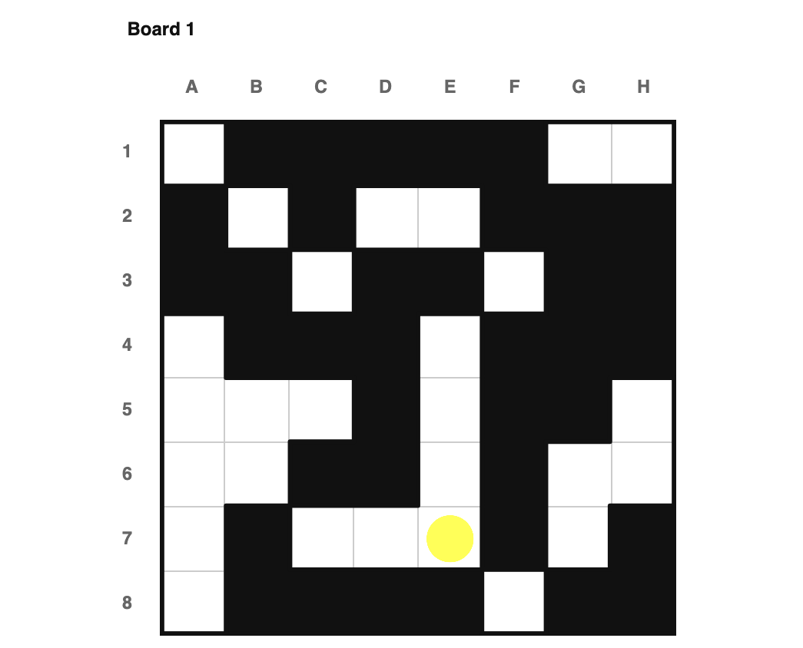

# How to Solve, Regionless

This is a companion to [how_to_solve.md](how_to_solve.md), for "regionless" boards —
puzzles with no drawn regions at all, just rows, columns, and voided-out cells. I
assume you've read that document already; I'm not re-deriving each technique here,
just showing which ones still work once regions are gone, and what they look like
without them.

All of the example puzzles below live in the `armory_regionless` book, and (since
every regionless puzzle I publish is single-board) each one is a single board rather
than a pair. Click any image to load that exact puzzle.

## The rules of the puzzle

<a href="index.html?book=armory_regionless&puzzle=1">
</img> </a>

"Only empty" doesn't care whether the unit in question is a region — a row or column
with exactly one empty cell left works exactly the same way. Here, row 4's only
non-void cell is E4, so E4 must be the star.

---

<a href="index.html?book=armory_regionless&puzzle=2">
</img> </a>

"Sees star" is entirely about rows, columns, and adjacency to begin with — regions
were never load-bearing for it. Here, G5 is already a star, so F5 (same row) and H4
(diagonally adjacent) both become dots.

## Notable shapes

Domino and triomino generalize directly too — in fact `triomino`'s actual
implementation only ever looks at rows and columns, never regions, so nothing
changes for it at all. The one casualty here is "sees too much": as implemented, it
only checks drawn regions, so it has no regionless equivalent. Triomino already
covers the row/column version of the same idea for any number of cells, not just
three, so nothing is lost.

<a href="index.html?book=armory_regionless&puzzle=3">
</img> </a>

F7 and F8 are column F's only two non-void cells, and they're adjacent — a domino.
So E7, G7, E8, and G8 (everything that touches either one) must be dots.

---

<a href="index.html?book=armory_regionless&puzzle=4">
</img> </a>

Column C's only three non-void cells are C6, C7, and C8. Whichever one ends up with
the star, B7 and D7 touch all three of them — so both must be dots.

## Adjacent and disjoint rows/cols

Both of these techniques are fundamentally about comparing a count of *regions* to a
count of rows/columns, so neither one has a regionless equivalent — there's nothing
to count. Row/col line sync (next) is the regionless-native version of the same
underlying idea.

## Row/col line sync

This is the one technique in the original document that already doesn't use regions
at all, so it survives regionless boards completely unchanged — this is the natural
tool to reach for whenever "adjacent rows/cols" or "disjoint rows/cols" would apply
to a regioned board.

<a href="index.html?book=armory_regionless&puzzle=5">
</img> </a>

Rows 5 and 8's only non-void cells are D5, H5, D8, and H8 — all inside columns D and
H, and rows 5/8 need exactly as many stars as columns D/H do. So the rest of those
columns — H2, H3, and D6 — must be dots.

## Tiles

Tiles never needed regions in the first place — a 2x2 block is a 2x2 block whether
or not it's inside a drawn region. Every tile technique from the original document
carries over: domino-style, sees-too-much-style, and pair-quota-fill. The one
exception is "tile falls inside a real drawn region" specifically, which obviously
has no regionless equivalent.

<a href="index.html?book=armory_regionless&puzzle=6">
</img> </a>

The row-pair here still needs 1 star, and its only two empty cells (C3, D4) form a
confirmed tile with a domino shape — so, same as an ordinary domino, B3 (which
touches both) must be a dot.

## Symmetry

Symmetry checks the void mask's own structure instead of region layout, but the
underlying idea — and the code path — is identical either way, so every symmetry
technique from the original document applies unchanged: diagonal self-symmetry,
diagonal parity, and 180-degree rotation all still work.

<a href="index.html?book=armory_regionless&puzzle=7">
</img> </a>

This board is symmetric across its main diagonal (↘). E4 and D5 are reflections of
each other and touch diagonally, so they can't both be stars — meaning neither can
be one, and both must be dots.

---

<a href="index.html?book=armory_regionless&puzzle=8">
</img> </a>

Same idea, 180-degree rotation this time: D4 and E5 are each other's rotation and
touch, so both must be dots.

---

<a href="index.html?book=armory_regionless&puzzle=9">
</img> </a>

This board is also diagonally symmetric, so the same parity argument as the original
document applies: since 8 is even, the diagonal needs an even number of stars
overall. Working through the diagonal's remaining candidates under that constraint
rules out a star at C3, so C3 must be a dot.

## Crossboard

Every crossboard technique compares regions across two different boards, so none of
them have a regionless equivalent — doubly so, since every regionless puzzle I
publish is single-board anyway.

## Lookahead

Half-stage lookahead didn't turn up in any of the regionless puzzles I sampled while
writing this — it may simply be too rare to matter for boards this sparse. Full
multi-stage lookahead, on the other hand, works exactly as before: hypothesize a
star, propagate the consequences, and see if some row or column runs out of room.

<a href="index.html?book=armory_regionless&puzzle=10">
</img> </a>

Here, a star at F3 eventually forces a contradiction elsewhere on the board once its
consequences are propagated — so F3 must be a dot.

---

That covers every 1★ technique from the original document that survives the jump to
regionless boards. See [how_to_solve2_regionless.md](how_to_solve2_regionless.md)
for the 2★+ techniques and their regionless equivalents.
